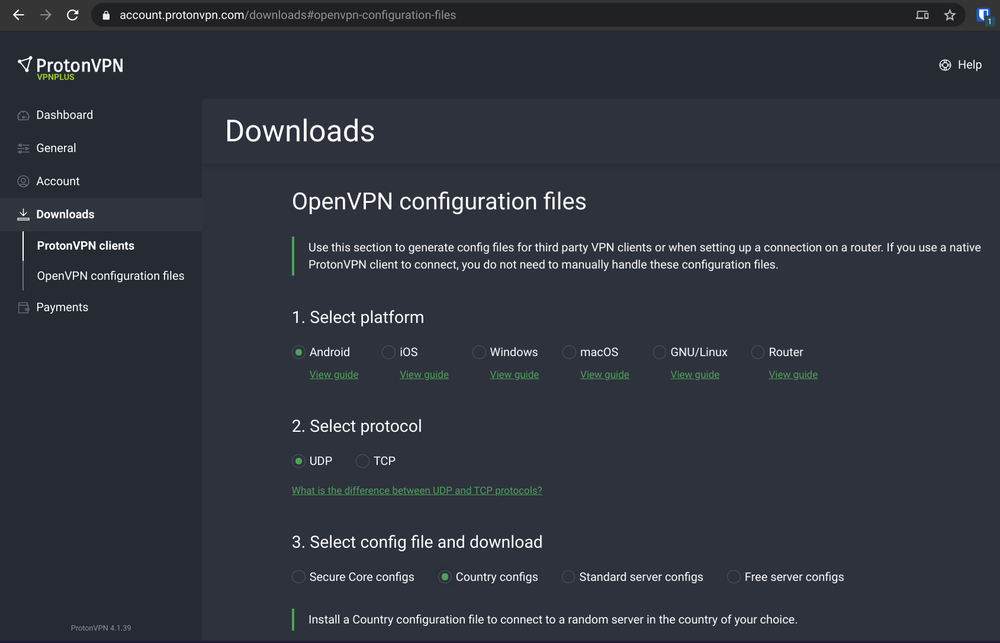
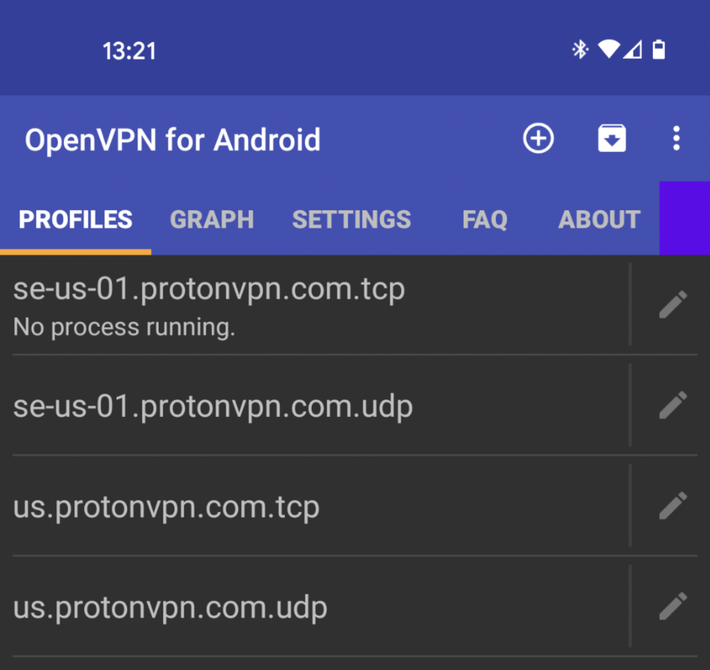
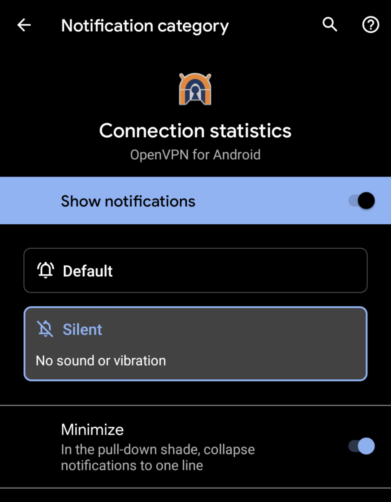
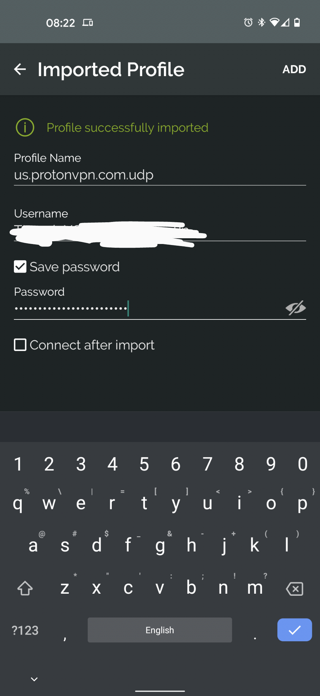

*[Update 2021-03-12] This solution recently stopped working for me. While looking for a fix, I found that OpenVPN had published [some notes](https://openvpn.net/faq/how-do-i-use-tasker-with-openvpn-connect-for-android/) on controlling the [official OpenVPN Connect app](https://play.google.com/store/apps/details?id=net.openvpn.openvpn) from Tasker. Jump to the [Update](#update) below to learn how I adapted my setup with this new knowledge.*

I recently shared how I use [Tasker and Home Assistant to keep my phone from charging past 80%](/safeguard-your-androids-battery-with-tasker-home-assistant). Today, I'm going to share the setup I use to automatically connect my phone to a VPN on networks I *don't* control.


### Background
Android has an option to [set a VPN as Always-On](https://support.google.com/android/answer/9089766#always-on_VPN) so for maximum security I could just use that. I'm not *overly* concerned (yet?) with my internet traffic being intercepted upstream of my ISP, though, and often need to connect to other devices on my home network without passing through a VPN (or introducing split-tunnel complexity). But I do want to be sure that my traffic is protected whenever I'm connected to a WiFi network controlled by someone else.

I've recently started using [ProtonVPN](https://protonvpn.com/) in conjunction with my paid ProtonMail account so these instructions are tailored to that particular VPN provider. I'm paying for the ProtonVPN Plus subscription but these instructions should also work for the [free tier](https://protonvpn.com/free-vpn) as well. (And this should work for any VPN which provides an OpenVPN config file - you'll just have to find that on your own.)

ProtonVPN does provide a quite excellent [Android app](https://play.google.com/store/apps/details?id=ch.protonvpn.android) but I couldn't find a way to automate it without root. (If your phone is rooted, you should be able to use a Tasker shell to run `cmd statusbar click-tile ch.protonvpn.android/com.protonvpn.android.components.QuickTileService` and avoid needing to use OpenVPN at all.)

### The apps
You'll need a few apps to make this work:

- [Tasker](https://play.google.com/store/apps/details?id=net.dinglisch.android.taskerm)
- [OpenVPN for Android](https://play.google.com/store/apps/details?id=de.blinkt.openvpn)
- [OpenVpn Tasker Plugin](https://play.google.com/store/apps/details?id=com.ffrog8.openVpnTaskerPlugin)

It's important to use the [open-source](https://github.com/schwabe/ics-openvpn) 'OpenVPN for Android' app by Arne Schwabe rather than the 'OpenVPN Connect' app as <s>the latter doesn't work with the Tasker plugin</s> that's what I used when I originally wrote this guide.

### OpenVPN config file
You can find instructions for configuring the OpenVPN client to work with ProtonVPN [here](https://protonvpn.com/support/android-vpn-setup/) but I'll go ahead and hit the highlights. You'll probably want to go ahead and do all this from your phone so you don't have to fuss with transferring files around, but hey, *you do you*.

1. Log in to your ProtonVPN account (or sign up for a new free one) at https://account.protonvpn.com/login.
2. Use the panel on the left side to navigate to **[Downloads > OpenVPN configuration files](https://account.protonvpn.com/downloads#openvpn-configuration-files)**.
3. Select the **Android** platform and **UDP** as the protocol, unless you have a [particular reason to use TCP](https://protonvpn.com/support/udp-tcp/#:~:text=When%20to%20use%20UDP%20vs.%20TCP).
4. Select and download the desired config file:
  - **Secure Core configs** utilize the [Secure Core](https://protonvpn.com/support/secure-core-vpn/) feature which connects you to a VPN node in your target country by way of a Proton-owned-and-managed server in privacy-friendly Iceland, Sweden, or Switzerland
  - **Country configs** connect to a random VPN node in your target country
  - **Standard server configs** let you choose the specific VPN node to use
  - **Free server configs** connect you to one of the VPN nodes available in the free tier


Feel free to download more than one if you'd like to have different profiles available within the OpenVPN app.

ProtonVPN automatically generates a set of user credentials to use with a third-party VPN client so that you don't have to share your personal creds. You'll want to make a note of that randomly-generated username and password so you can plug them in to the OpenVPN app later. You can find the details at **[Account > OpenVPN / IKEv2 username](https://account.protonvpn.com/account#openvpn)**.

**Now that you've got the profile file, skip on down to [The Update](#update) to import it into OpenVPN Connect.**

### Configuring OpenVPN for Android
Now what you've got the config file(s) and your client credentials, it's time to actually configure that client.



1. Launch the OpenVPN for Android app and tap the little 'downvote-in-a-box' "Import" icon.
2. Browse to wherever you saved the `.ovpn` config files and select the one you'd like to use.
3. You can rename if it you'd like but I feel that `us.protonvpn.com.udp` is pretty self-explanatory and will do just fine to distinguish between my profiles. Tap the check mark at the top-right or the floppy icon at the bottom right to confirm the import.
4. Now tap the pencil icon next to the new entry to edit its settings, and paste in the OpenVPN username and password where appropriate. Use your phone's back button/gesture to save the config and return to the list.
5. Repeat for any other configurations you'd like to import. We'll only use one for this particular Tasker profile but you might come up with different needs for different scenarios.
6. And finally, tap on the config name to test the connection. The OpenVPN Log window will appear, and you want the line at the top to (eventually) display something like `Connected: SUCCESS`.

Success!

I don't like to have a bunch of persistent notification icons hanging around (and Android already shows a persistent status icon when a VPN connection is active). If you're like me, long-press the OpenVPN notification and tap the gear icon. Then tap on the **Connection statistics** category and activate the **Minimized** slider. The notification will still appear, but it will collapse to the bottom of your notification stack and you won't get bugged by the icon.



### Tasker profiles
Open up Tasker and get ready to automate! We're going to wind up with at least two new Tasker profiles so (depending on how many you already have) you might want to create a new project by long-pressing the Home icon at the bottom-left of the screen and selecting the **Add** option. I chose to group all my VPN-related profiles in a project named (oh-so-creatively) "VPN". Totally your call though.

Let's start with a profile to track whether or not we're connected to one of our preferred/trusted WiFi networks:

#### Trusted WiFi
1. Tap the '+' sign to create a new profile, and add a new **State > Net > Wifi Connected** context. This profile will become active whenever your phone connects to WiFi.
2. Tap the magnifying glass next to the **SSID** field, which will pop up a list of all detected nearby network identifiers. Tap to select whichever network(s) you'd like to be considered "safe". You can also manually enter the SSID names, separating multiple options with a `/` (ex, `FBI Surveillance Van/TellMyWifiLoveHer/Pretty fly for a WiFi`). Or, for more security, identify the networks based on the MACs instead of the SSIDs - just be sure to capture the MACs for any extenders or mesh nodes too!
3. Once you've got your networks added, tap the back button to move *forward* to the next task (Ah, Android!): configuring the *action* which will occur when the context is satisfied.
4. Tap the **New Task** option and then tap the check mark to skip giving it a name (no need).
5. Hit the '+' button to add an action and select **Variables > Variable Set**.
6. For **Name**, enter `%TRUSTED_WIFI` (all caps to make it a "public" variable), and for the **To** field just enter `1`.
7. Hit back to save the action, and back again to save the profile.
8. Back at the profile list, long-press on the **Variable Set...** action and then select **Add Exit Task**.
9. We want to un-set the variable when no longer connected to a trusted WiFi network so add a new **Variables > Variable Clear** action and set the name to `%TRUSTED_WIFI`.
10. And back back out to admire your handiwork. Here's a recap of the profile:
```
Profile: Trusted Wifi
State: Wifi Connected [ SSID:FBI Surveillance Van/TellMyWifiLoveHer/Pretty fly for a WiFi MAC:* IP:* Active:Any ]
Enter: Anon
A1: Variable Set [ Name:%TRUSTED_WIFI To:1 Recurse Variables:Off Do Maths:Off Append:Off Max Rounding Digits:0 ]
Exit: Anon
A1: Variable Clear [ Name:%TRUSTED_WIFI Pattern Matching:Off Local Variables Only:Off Clear All Variables:Off ]
```
Onward!

#### VPN on Strange WiFi
This profile will kick in if the phone connects to a WiFi network which isn't on the "approved" list - when the `%TRUSTED_WIFI` variable is not set.

1. It starts out the same way by creating a new profile with the **State > Net > Wifi Connected** context but this time don't add any network names to the list.
2. For the action, select **Plugin > OpenVpn Tasker Plugin**, tap the pencil icon to edit the configuration, and select your VPN profile from the list under **Connect using profile**
3. Back at the Action Edit screen, tap the checkbox next to **If** and enter the variable name `%TRUSTED_WIFI`. Tap the '~' button to change the condition operator to **Isn't Set**. So while this profile will activate every time you connect to WiFi, the action which connects to the VPN will only fire if the WiFi isn't a trusted network.
4. Back out to the profile list and add a new Exit Task.
5. Add another **Plugin > OpenVpn Tasker Plugin** task and this time configure it to **Disconnect VPN**.

To recap:
```
Profile: VPN on Strange Wifi
State: Wifi Connected [ SSID:* MAC:* IP:* Active:Any ]
Enter: Anon
A1: OpenVPN [ Configuration:Connect (us.protonvpn.com.udp) Timeout (Seconds):0 ] If [ %TRUSTED_WIFI !Set ]
Exit: Anon
A1: OpenVPN [ Configuration:Disconnect Timeout (Seconds):0 ]
```

### Conclusion
Give it a try - the VPN should automatically activate the next time you connect to a network that's not on your list. If you find that it's not working correctly, you might try adding a short 3-5 second **Task > Wait** action before the connect/disconnect actions just to give a brief cooldown between state changes.

### Epilogue: working with Google's VPN
My Google Pixel 5 has a neat option at **Settings > Network & internet > Wi-Fi > Wi-Fi preferences > Connect to public networks** which will automatically connect the phone to known-decent public WiFi networks and automatically tunnel the connection through a Google VPN. It doesn't provide quite as much privacy as ProtonVPN, of course, but it's enough to keep my traffic safe from prying eyes on those public networks, and the auto-connection option really comes in handy sometimes. Of course, my Tasker setup would see that I'm connected to an unknown network and try to connect to ProtonVPN at the same time the phone was trying to connect to the Google VPN. That wasn't ideal.

I came up with a workaround to treat any network with the Google VPN as "trusted" as long as that VPN was active. I inserted a 10-second Wait before the Connect and Disconnect actions to give the VPN time to stand up, and added two new profiles to detect the Google VPN connection and disconnection.

#### Google VPN On
This one uses an **Event > System > Logcat Entry**. The first time you try to use that you'll be prompted to use adb to grant Tasker the READ_LOGS permission but the app actually does a great job of walking you through that setup. We'll watch the `Vpn` component and filter for `Established by com.google.android.apps.gcs on tun0`, and then set the `%TRUSTED_WIFI` variable:
```
Profile: Google VPN On
Event: Logcat Entry [ Output Variables:* Component:Vpn Filter:Established by com.google.android.apps.gcs on tun0 Grep Filter (Check Help):Off ]
Enter: Anon
A1: Variable Set [ Name:%TRUSTED_WIFI To:1 Recurse Variables:Off Do Maths:Off Append:Off Max Rounding Digits:3 ]
```

#### Google VPN Off
This one is pretty much the same but the opposite:
```
Profile: Google VPN Off
Event: Logcat Entry [ Output Variables:* Component:Vpn Filter:setting state=DISCONNECTED, reason=agentDisconnect Grep Filter (Check Help):Off ]
Enter: Anon
A1: Variable Clear [ Name:%TRUSTED_WIFI Pattern Matching:Off Local Variables Only:Off Clear All Variables:Off ]
```

### Update
#### OpenVPN Connect app configuration
After installing and launching the official [OpenVPN Connect app](https://play.google.com/store/apps/details?id=net.openvpn.openvpn), tap the "+" button at the bottom right to create a new profile. Swipe over to the "File" tab and import the `*.ovpn` file you downloaded from ProtonVPN. Paste in the username, tick the "Save password" box, and paste in the password as well. I also chose to rename the profile to something a little bit more memorable - you'll need this name later. From there, hit the "Add" button and then go ahead and tap on your profile to test the connection.



#### Tasker profiles
Go ahead and create the [Trusted Wifi profile](#trusted-wifi) as described above.

The condition for the [VPN on Strange Wifi profile](#vpn-on-strange-wifi) will be the same, but the task will be different. This time, add a **System > Send Intent** action. You'll need to enter the following details, leaving the other fields blank/default:

```
Action: net.openvpn.openvpn.CONNECT
Cat: None
Extra: net.openvpn.openvpn.AUTOSTART_PROFILE_NAME:PC us.protonvpn.com.udp (replace with your profile name)
Extra: net.openvpn.openvpn.AUTOCONNECT:true
Extra: net.openvpn.openvpn.APP_SECTION:PC
Package: net.openvpn.openvpn
Class: net.openvpn.unified.MainActivity
Target: Activity
If: %TRUSTED_WIFI !Set
```

The Exit Task to disconnect from the VPN uses a similar intent:

```
Action: net.openvpn.openvpn.DISCONNECT
Cat: None
Extra: net.openvpn.openvpn.STOP:true
Package: net.openvpn.openvpn
Class: net.openvpn.unified.MainActivity
Target: Activity
```

All set! You can pop back up to the [Epilogue](#epilogue-working-with-googles-vpn) section to continue tweaking to avoid conflicts with Google's auto-connect VPN if you'd like.