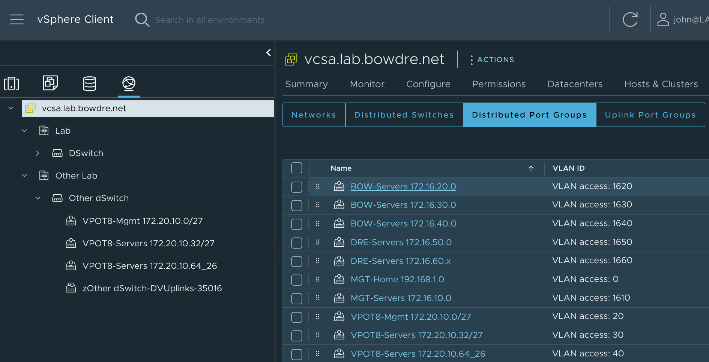
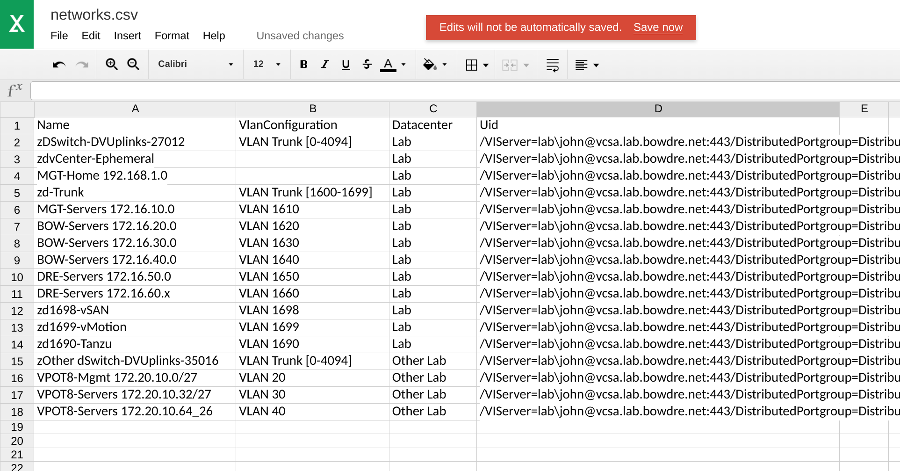
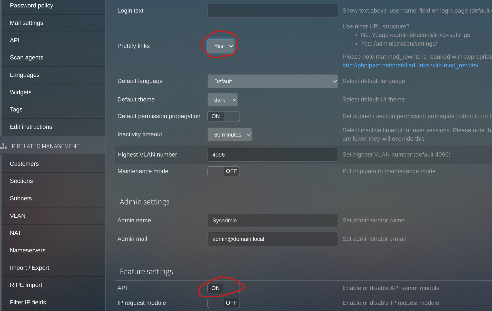
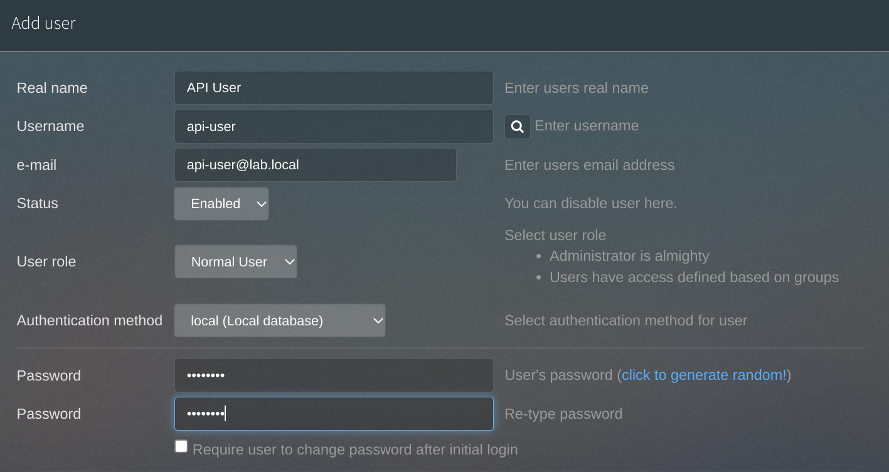
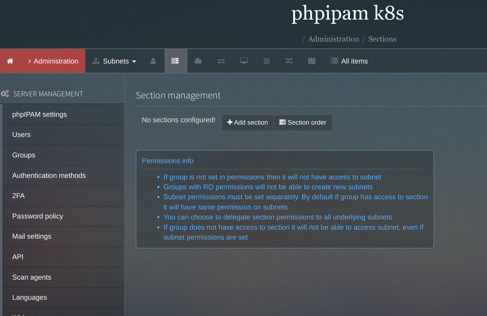
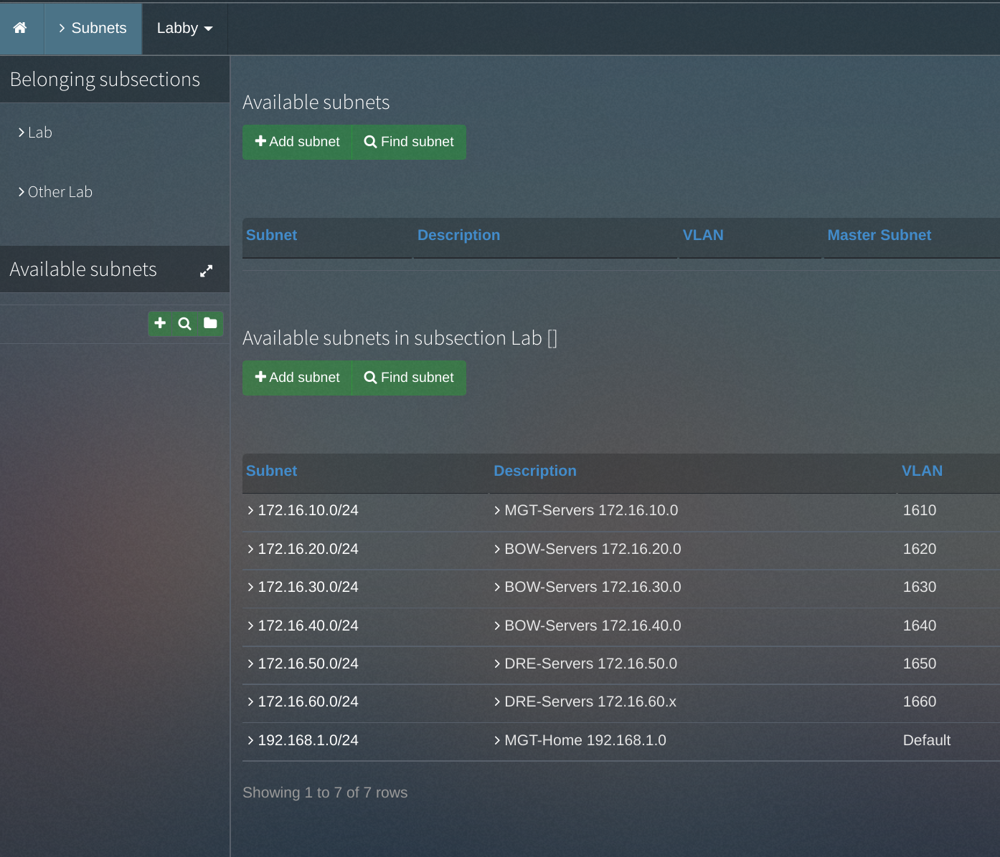
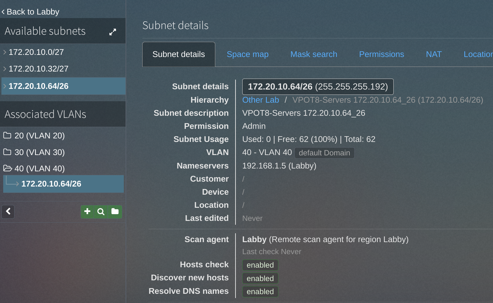
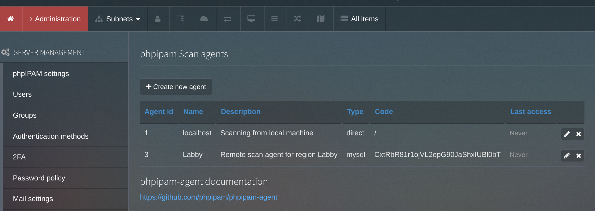
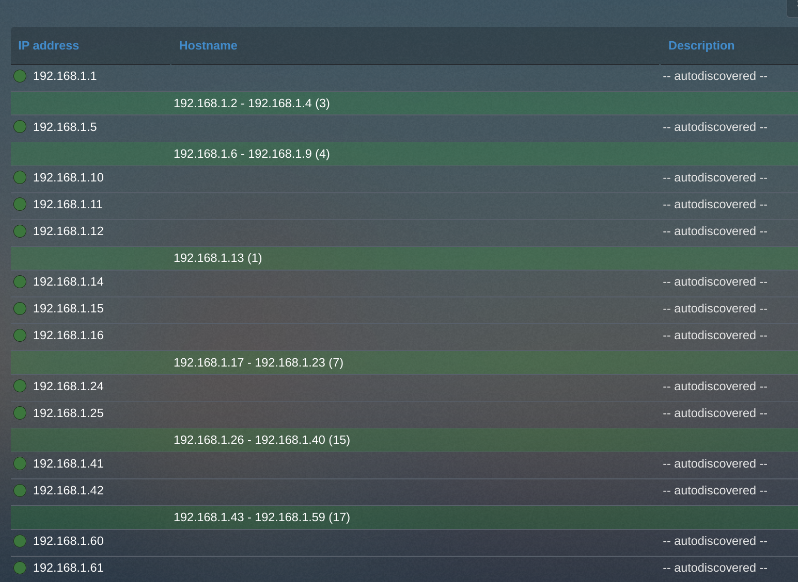

I [recently wrote](/tanzu-community-edition-k8s-homelab/#a-real-workload---phpipam) about getting started with VMware's [Tanzu Community Edition](https://tanzucommunityedition.io/) and deploying [phpIPAM](https://phpipam.net/) as my first real-world Kubernetes workload. Well I've spent much of my time since then working on a script which would help to populate my phpIPAM instance with a list of networks to monitor.

### Planning and Exporting
The first step in making this work was to figure out which networks I wanted to import. We've got hundreds of different networks in use across our production vSphere environments. I focused only on those which are portgroups on distributed virtual switches since those configurations are pretty standardized (being vCenter constructs instead of configured on individual hosts). These dvPortGroups bear a naming standard which conveys all sorts of useful information, and it's easy and safe to rename any dvPortGroups which _don't_ fit the standard (unlike renaming portgroups on a standard virtual switch).

The standard naming convention is `[Site/Description] [Network Address]{/[Mask]}`. So the networks (across two virtual datacenters and two dvSwitches) look something like this:


Some networks have masks in the name, some don't; and some use an underscore (`_`) rather than a slash (`/`) to separate the network from the mask . Most networks correctly include the network address with a `0` in the last octet, but some use an `x` instead. And the VLANs associated with the networks have a varying number of digits. Consistency can be difficult so these are all things that I had to keep in mind as I worked on a solution which would make a true best effort at importing all of these.

As long as the dvPortGroup names stick to this format I can parse the name to come up with a description as well as the IP space of the network. The dvPortGroup also carries information about the associated VLAN, which is useful information to have. And I can easily export this information with a simple PowerCLI query:

```powershell
PS /home/john> get-vdportgroup | select Name, VlanConfiguration

Name                           VlanConfiguration
----                           -----------------
MGT-Home 192.168.1.0
MGT-Servers 172.16.10.0        VLAN 1610
BOW-Servers 172.16.20.0        VLAN 1620
BOW-Servers 172.16.30.0        VLAN 1630
BOW-Servers 172.16.40.0        VLAN 1640
DRE-Servers 172.16.50.0        VLAN 1650
DRE-Servers 172.16.60.x        VLAN 1660
VPOT8-Mgmt 172.20.10.0/27      VLAN 20
VPOT8-Servers 172.20.10.32/27  VLAN 30
VPOT8-Servers 172.20.10.64_26  VLAN 40
```

In my [homelab](/vmware-home-lab-on-intel-nuc-9/), I only have a single vCenter. In production, we've got a handful of vCenters, and each manages the hosts in a given region. So I can use information about which vCenter hosts a dvPortGroup to figure out which region a network is in. When I import this data into phpIPAM, I can use the vCenter name to assign [remote scan agents](https://github.com/jbowdre/phpipam-agent-docker) to networks based on the region that they're in. I can also grab information about which virtual datacenter a dvPortGroup lives in, which I'll use for grouping networks into sites or sections.

The vCenter can be found in the `Uid` property returned by `get-vdportgroup`:
```powershell
PS /home/john> get-vdportgroup | select Name, VlanConfiguration, Datacenter, Uid

Name                     VlanConfiguration   Datacenter Uid
----                     -----------------   ---------- ---
MGT-Home 192.168.1.0                         Lab        /VIServer=lab\john@vcsa.lab.bowdre.net:443/DistributedPortgroup=DistributedVirtualPortgroup-dvportgroup-27015/
MGT-Servers 172.16.10.0  VLAN 1610           Lab        /VIServer=lab\john@vcsa.lab.bowdre.net:443/DistributedPortgroup=DistributedVirtualPortgroup-dvportgroup-27017/
BOW-Servers 172.16.20.0  VLAN 1620           Lab        /VIServer=lab\john@vcsa.lab.bowdre.net:443/DistributedPortgroup=DistributedVirtualPortgroup-dvportgroup-28010/
BOW-Servers 172.16.30.0  VLAN 1630           Lab        /VIServer=lab\john@vcsa.lab.bowdre.net:443/DistributedPortgroup=DistributedVirtualPortgroup-dvportgroup-28011/
BOW-Servers 172.16.40.0  VLAN 1640           Lab        /VIServer=lab\john@vcsa.lab.bowdre.net:443/DistributedPortgroup=DistributedVirtualPortgroup-dvportgroup-28012/
DRE-Servers 172.16.50.0  VLAN 1650           Lab        /VIServer=lab\john@vcsa.lab.bowdre.net:443/DistributedPortgroup=DistributedVirtualPortgroup-dvportgroup-28013/
DRE-Servers 172.16.60.x  VLAN 1660           Lab        /VIServer=lab\john@vcsa.lab.bowdre.net:443/DistributedPortgroup=DistributedVirtualPortgroup-dvportgroup-28014/
VPOT8-Mgmt 172.20.10.0/… VLAN 20             Other Lab  /VIServer=lab\john@vcsa.lab.bowdre.net:443/DistributedPortgroup=DistributedVirtualPortgroup-dvportgroup-35018/
VPOT8-Servers 172.20.10… VLAN 30             Other Lab  /VIServer=lab\john@vcsa.lab.bowdre.net:443/DistributedPortgroup=DistributedVirtualPortgroup-dvportgroup-35019/
VPOT8-Servers 172.20.10… VLAN 40             Other Lab  /VIServer=lab\john@vcsa.lab.bowdre.net:443/DistributedPortgroup=DistributedVirtualPortgroup-dvportgroup-35020/
```

It's not pretty, but it'll do the trick. All that's left is to export this data into a handy-dandy CSV-formatted file that I can easily parse for import:

```powershell
get-vdportgroup | select Name, VlanConfiguration, Datacenter, Uid | export-csv -NoTypeInformation ./networks.csv
```


### Setting up phpIPAM
After [deploying a fresh phpIPAM instance on my Tanzu Community Edition Kubernetes cluster](/tanzu-community-edition-k8s-homelab/#a-real-workload---phpipam), there are a few additional steps needed to enable API access. To start, I log in to my phpIPAM instance and navigate to the **Administration > Server Management > phpIPAM Settings** page, where I enabled both the *Prettify links* and *API* feature settings - making sure to hit the **Save** button at the bottom of the page once I do so.


Then I need to head to the **User Management** page to create a new user that will be used to authenticate against the API:


And finally, I head to the **API** section to create a new API key with Read/Write permissions:


I'm also going to head in to **Administration > IP Related Management > Sections** and delete the default sample sections so that the inventory will be nice and empty:


### Script time
Well that's enough prep work; now it's time for the Python3 [script](https://github.com/jbowdre/misc-scripts/blob/main/Python/phpipam-bulk-import.py):

```python {linenos=true}
# The latest version of this script can be found on Github:
# https://github.com/jbowdre/misc-scripts/blob/main/Python/phpipam-bulk-import.py

import requests
from collections import namedtuple

check_cert = True
created = 0
remote_agent = False
name_to_id = namedtuple('name_to_id', ['name', 'id'])

## for testing only:
# from requests.packages.urllib3.exceptions import InsecureRequestWarning
# requests.packages.urllib3.disable_warnings(InsecureRequestWarning)
# check_cert = False

## Makes sure input fields aren't blank.
def validate_input_is_not_empty(field, prompt):
  while True:
    user_input = input(f'\n{prompt}:\n')
    if len(user_input) == 0:
      print(f'[ERROR] {field} cannot be empty!')
      continue
    else:
      return user_input


## Takes in a list of dictionary items, extracts all the unique values for a given key,
#  and returns a sorted list of those.
def get_sorted_list_of_unique_values(key, list_of_dict):
  valueSet = set(sub[key] for sub in list_of_dict)
  valueList = list(valueSet)
  valueList.sort()
  return valueList


## Match names and IDs
def get_id_from_sets(name, sets):
  return [item.id for item in sets if name == item.name][0]


## Authenticate to phpIPAM endpoint and return an auth token
def auth_session(uri, auth):
  print(f'Authenticating to {uri}...')
  try:
    req = requests.post(f'{uri}/user/', auth=auth, verify=check_cert)
  except:
    raise requests.exceptions.RequestException
  if req.status_code != 200:
    print(f'[ERROR] Authentication failure: {req.json()}')
    raise requests.exceptions.RequestException
  token = {"token": req.json()['data']['token']}
  print('\n[AUTH_SUCCESS] Authenticated successfully!')
  return token


## Find or create a remote scan agent for each region (vcenter)
def get_agent_sets(uri, token, regions):
  agent_sets = []

  def create_agent_set(uri, token, name):
    import secrets
    # generate a random secret to be used for identifying this agent
    payload = {
      'name': name,
      'type': 'mysql',
      'code': secrets.base64.urlsafe_b64encode(secrets.token_bytes(24)).decode("utf-8"),
      'description': f'Remote scan agent for region {name}'
    }
    req = requests.post(f'{uri}/tools/scanagents/', data=payload, headers=token, verify=check_cert)
    id = req.json()['id']
    agent_set = name_to_id(name, id)
    print(f'[AGENT_CREATE] {name} created.')
    return agent_set

  for region in regions:
    name = regions[region]['name']
    req = requests.get(f'{uri}/tools/scanagents/?filter_by=name&filter_value={name}', headers=token, verify=check_cert)
    if req.status_code == 200:
      id = req.json()['data'][0]['id']
      agent_set = name_to_id(name, id)
    else:
      agent_set = create_agent_set(uri, token, name)
    agent_sets.append(agent_set)
  return agent_sets


## Find or create a section for each virtual datacenter
def get_section(uri, token, section, parentSectionId):

  def create_section(uri, token, section, parentSectionId):
    payload = {
      'name': section,
      'masterSection': parentSectionId,
      'permissions': '{"2":"2"}',
      'showVLAN': '1'
    }
    req = requests.post(f'{uri}/sections/', data=payload, headers=token, verify=check_cert)
    id = req.json()['id']
    print(f'[SECTION_CREATE] Section {section} created.')
    return id

  req = requests.get(f'{uri}/sections/{section}/', headers=token, verify=check_cert)
  if req.status_code == 200:
    id = req.json()['data']['id']
  else:
    id = create_section(uri, token, section, parentSectionId)
  return id


## Find or create VLANs
def get_vlan_sets(uri, token, vlans):
  vlan_sets = []

  def create_vlan_set(uri, token, vlan):
    payload = {
      'name': f'VLAN {vlan}',
      'number': vlan
    }
    req = requests.post(f'{uri}/vlan/', data=payload, headers=token, verify=check_cert)
    id = req.json()['id']
    vlan_set = name_to_id(vlan, id)
    print(f'[VLAN_CREATE] VLAN {vlan} created.')
    return vlan_set

  for vlan in vlans:
    if vlan != 0:
      req = requests.get(f'{uri}/vlan/?filter_by=number&filter_value={vlan}', headers=token, verify=check_cert)
      if req.status_code == 200:
        id = req.json()['data'][0]['vlanId']
        vlan_set = name_to_id(vlan, id)
      else:
        vlan_set = create_vlan_set(uri, token, vlan)
      vlan_sets.append(vlan_set)
  return vlan_sets


## Find or create nameserver configurations for each region
def get_nameserver_sets(uri, token, regions):

  nameserver_sets = []

  def create_nameserver_set(uri, token, name, nameservers):
    payload = {
      'name': name,
      'namesrv1': nameservers,
      'description': f'Nameserver created for region {name}'
    }
    req = requests.post(f'{uri}/tools/nameservers/', data=payload, headers=token, verify=check_cert)
    id = req.json()['id']
    nameserver_set = name_to_id(name, id)
    print(f'[NAMESERVER_CREATE] Nameserver {name} created.')
    return nameserver_set

  for region in regions:
    name = regions[region]['name']
    req = requests.get(f'{uri}/tools/nameservers/?filter_by=name&filter_value={name}', headers=token, verify=check_cert)
    if req.status_code == 200:
      id = req.json()['data'][0]['id']
      nameserver_set = name_to_id(name, id)
    else:
      nameserver_set = create_nameserver_set(uri, token, name, regions[region]['nameservers'])
    nameserver_sets.append(nameserver_set)
  return nameserver_sets


## Find or create subnet for each dvPortGroup
def create_subnet(uri, token, network):

  def update_nameserver_permissions(uri, token, network):
    nameserverId = network['nameserverId']
    sectionId = network['sectionId']
    req = requests.get(f'{uri}/tools/nameservers/{nameserverId}/', headers=token, verify=check_cert)
    permissions = req.json()['data']['permissions']
    permissions = str(permissions).split(';')
    if not sectionId in permissions:
      permissions.append(sectionId)
      if 'None' in permissions:
        permissions.remove('None')
      permissions = ';'.join(permissions)
      payload = {
        'permissions': permissions
      }
      req = requests.patch(f'{uri}/tools/nameservers/{nameserverId}/', data=payload, headers=token, verify=check_cert)

  payload = {
    'subnet': network['subnet'],
    'mask': network['mask'],
    'description': network['name'],
    'sectionId': network['sectionId'],
    'scanAgent': network['agentId'],
    'nameserverId': network['nameserverId'],
    'vlanId': network['vlanId'],
    'pingSubnet': '1',
    'discoverSubnet': '1',
    'resolveDNS': '1',
    'DNSrecords': '1'
  }
  req = requests.post(f'{uri}/subnets/', data=payload, headers=token, verify=check_cert)
  if req.status_code == 201:
    network['subnetId'] = req.json()['id']
    update_nameserver_permissions(uri, token, network)
    print(f"[SUBNET_CREATE] Created subnet {req.json()['data']}")
    global created
    created += 1
  elif req.status_code == 409:
    print(f"[SUBNET_EXISTS] Subnet {network['subnet']}/{network['mask']} already exists.")
  else:
    print(f"[ERROR] Problem creating subnet {network['name']}: {req.json()}")


## Import list of networks from the specified CSV file
def import_networks(filepath):
  print(f'Importing networks from {filepath}...')
  import csv
  import re
  ipPattern = re.compile('\d{1,3}\.\d{1,3}\.\d{1,3}\.[0-9xX]{1,3}')
  networks = []
  with open(filepath) as csv_file:
    reader = csv.DictReader(csv_file)
    line_count = 0
    for row in reader:
      network = {}
      if line_count > 0:
        if(re.search(ipPattern, row['Name'])):
          network['subnet'] = re.findall(ipPattern, row['Name'])[0]
          if network['subnet'].split('.')[-1].lower() == 'x':
            network['subnet'] = network['subnet'].lower().replace('x', '0')
          network['name'] = row['Name']
          if '/' in row['Name'][-3]:
            network['mask'] = row['Name'].split('/')[-1]
          elif '_' in row['Name'][-3]:
            network['mask'] = row['Name'].split('_')[-1]
          else:
            network['mask'] = '24'
          network['section'] = row['Datacenter']
          try:
            network['vlan'] = int(row['VlanConfiguration'].split('VLAN ')[1])
          except:
            network['vlan'] = 0
          network['vcenter'] = f"{(row['Uid'].split('@'))[1].split(':')[0].split('.')[0]}"
          networks.append(network)
      line_count += 1
    print(f'Processed {line_count} lines and found:')
  return networks


def main():
  import socket
  import getpass
  import argparse
  from pathlib import Path

  parser = argparse.ArgumentParser()
  parser.add_argument("filepath", type=Path)

  # Accept CSV file as an argument to the script or prompt for input if necessary
  try:
    p = parser.parse_args()
    filepath = p.filepath
  except:
    # make sure filepath is a path to an actual file
    print("""\n\n
    This script helps to add vSphere networks to phpIPAM for IP address management. It is expected
    that the vSphere networks are configured as portgroups on distributed virtual switches and
    named like '[Description] [Subnet IP]{/[mask]}' (ex: 'LAB-Servers 192.168.1.0'). The following PowerCLI
    command can be used to export the networks from vSphere:

      Get-VDPortgroup | Select Name, Datacenter, VlanConfiguration, Uid | Export-Csv -NoTypeInformation ./networks.csv

    Subnets added to phpIPAM will be automatically configured for monitoring either using the built-in
    scan agent (default) or a new remote scan agent for each vCenter.
    """)
    while True:
      filepath = Path(validate_input_is_not_empty('Filepath', 'Path to CSV-formatted export from vCenter'))
      if filepath.exists():
        break
      else:
        print(f'[ERROR] Unable to find file at {filepath.name}.')
        continue

  # get collection of networks to import
  networks = import_networks(filepath)
  networkNames = get_sorted_list_of_unique_values('name', networks)
  print(f'\n- {len(networkNames)} networks:\n\t{networkNames}')
  vcenters = get_sorted_list_of_unique_values('vcenter', networks)
  print(f'\n- {len(vcenters)} vCenter servers:\n\t{vcenters}')
  vlans = get_sorted_list_of_unique_values('vlan', networks)
  print(f'\n- {len(vlans)} VLANs:\n\t{vlans}')
  sections = get_sorted_list_of_unique_values('section', networks)
  print(f'\n- {len(sections)} Datacenters:\n\t{sections}')

  regions = {}
  for vcenter in vcenters:
    nameservers = None
    name = validate_input_is_not_empty('Region Name', f'Region name for vCenter {vcenter}')
    for region in regions:
      if name in regions[region]['name']:
        nameservers = regions[region]['nameservers']
    if not nameservers:
      nameservers = validate_input_is_not_empty('Nameserver IPs', f"Comma-separated list of nameserver IPs in {name}")
      nameservers = nameservers.replace(',',';').replace(' ','')
    regions[vcenter] = {'name': name, 'nameservers': nameservers}

  # make sure hostname resolves
  while True:
    hostname = input('\nFully-qualified domain name of the phpIPAM host:\n')
    if len(hostname) == 0:
      print('[ERROR] Hostname cannot be empty.')
      continue
    try:
      test = socket.gethostbyname(hostname)
    except:
      print(f'[ERROR] Unable to resolve {hostname}.')
      continue
    else:
      del test
      break

  username = validate_input_is_not_empty('Username', f'Username with read/write access to {hostname}')
  password = getpass.getpass(f'Password for {username}:\n')
  apiAppId = validate_input_is_not_empty('App ID', f'App ID for API key (from https://{hostname}/administration/api/)')

  agent = input('\nUse per-region remote scan agents instead of a single local scanner? (y/N):\n')
  try:
    if agent.lower()[0] == 'y':
      global remote_agent
      remote_agent = True
  except:
    pass

  proceed = input(f'\n\nProceed with importing {len(networkNames)} networks to {hostname}? (y/N):\n')
  try:
    if proceed.lower()[0] == 'y':
      pass
    else:
      import sys
      sys.exit("Operation aborted.")
  except:
    import sys
    sys.exit("Operation aborted.")
  del proceed

  # assemble variables
  uri = f'https://{hostname}/api/{apiAppId}'
  auth = (username, password)

  # auth to phpIPAM
  token = auth_session(uri, auth)

  # create nameserver entries
  nameserver_sets = get_nameserver_sets(uri, token, regions)
  vlan_sets = get_vlan_sets(uri, token, vlans)
  if remote_agent:
    agent_sets = get_agent_sets(uri, token, regions)

  # create the networks
  for network in networks:
    network['region'] = regions[network['vcenter']]['name']
    network['regionId'] = get_section(uri, token, network['region'], None)
    network['nameserverId'] = get_id_from_sets(network['region'], nameserver_sets)
    network['sectionId'] = get_section(uri, token, network['section'], network['regionId'])
    if network['vlan'] == 0:
      network['vlanId'] = None
    else:
      network['vlanId'] = get_id_from_sets(network['vlan'], vlan_sets)
    if remote_agent:
      network['agentId'] = get_id_from_sets(network['region'], agent_sets)
    else:
      network['agentId'] = '1'
    create_subnet(uri, token, network)

  print(f'\n[FINISH] Created {created} of {len(networks)} networks.')


if __name__ == "__main__":
  main()

```

I'll run it and provide the path to the network export CSV file:
```command
python3 phpipam-bulk-import.py ~/networks.csv
```

The script will print out a little descriptive bit about what sort of networks it's going to try to import and then will straight away start processing the file to identify the networks, vCenters, VLANs, and datacenters which will be imported:

```
Importing networks from /home/john/networks.csv...
Processed 17 lines and found:

- 10 networks:
        ['BOW-Servers 172.16.20.0', 'BOW-Servers 172.16.30.0', 'BOW-Servers 172.16.40.0', 'DRE-Servers 172.16.50.0', 'DRE-Servers 172.16.60.x', 'MGT-Home 192.168.1.0', 'MGT-Servers 172.16.10.0', 'VPOT8-Mgmt 172.20.10.0/27', 'VPOT8-Servers 172.20.10.32/27', 'VPOT8-Servers 172.20.10.64_26']

- 1 vCenter servers:
        ['vcsa']

- 10 VLANs:
        [0, 20, 30, 40, 1610, 1620, 1630, 1640, 1650, 1660]

- 2 Datacenters:
        ['Lab', 'Other Lab']
```

It then starts prompting for the additional details which will be needed:

```
Region name for vCenter vcsa:
Labby

Comma-separated list of nameserver IPs in Lab vCenter:
192.168.1.5

Fully-qualified domain name of the phpIPAM host:
ipam-k8s.lab.bowdre.net

Username with read/write access to ipam-k8s.lab.bowdre.net:
api-user
Password for api-user:


App ID for API key (from https://ipam-k8s.lab.bowdre.net/administration/api/):
api-user

Use per-region remote scan agents instead of a single local scanner? (y/N):
y
```

Up to this point, the script has only been processing data locally, getting things ready for talking to the phpIPAM API. But now, it prompts to confirm that we actually want to do the thing (yes please) and then gets to work:

```
Proceed with importing 10 networks to ipam-k8s.lab.bowdre.net? (y/N):
y
Authenticating to https://ipam-k8s.lab.bowdre.net/api/api-user...

[AUTH_SUCCESS] Authenticated successfully!
[VLAN_CREATE] VLAN 20 created.
[VLAN_CREATE] VLAN 30 created.
[VLAN_CREATE] VLAN 40 created.
[VLAN_CREATE] VLAN 1610 created.
[VLAN_CREATE] VLAN 1620 created.
[VLAN_CREATE] VLAN 1630 created.
[VLAN_CREATE] VLAN 1640 created.
[VLAN_CREATE] VLAN 1650 created.
[VLAN_CREATE] VLAN 1660 created.
[SECTION_CREATE] Section Labby created.
[SECTION_CREATE] Section Lab created.
[SUBNET_CREATE] Created subnet 192.168.1.0/24
[SUBNET_CREATE] Created subnet 172.16.10.0/24
[SUBNET_CREATE] Created subnet 172.16.20.0/24
[SUBNET_CREATE] Created subnet 172.16.30.0/24
[SUBNET_CREATE] Created subnet 172.16.40.0/24
[SUBNET_CREATE] Created subnet 172.16.50.0/24
[SUBNET_CREATE] Created subnet 172.16.60.0/24
[SECTION_CREATE] Section Other Lab created.
[SUBNET_CREATE] Created subnet 172.20.10.0/27
[SUBNET_CREATE] Created subnet 172.20.10.32/27
[SUBNET_CREATE] Created subnet 172.20.10.64/26

[FINISH] Created 10 of 10 networks.
```

Success! Now I can log in to my phpIPAM instance and check out my newly-imported subnets:


Even the one with the weird name formatting was parsed and imported correctly:


So now phpIPAM knows about the vSphere networks I care about, and it can keep track of which vLAN and nameservers go with which networks. Great! But it still isn't scanning or monitoring those networks, even though I told the script that I wanted to use a remote scan agent. And I can check in the **Administration > Server management > Scan agents** section of the phpIPAM interface to see my newly-created agent configuration.


... but I haven't actually *deployed* an agent yet. I'll do that by following the same basic steps [described here](/tanzu-community-edition-k8s-homelab/#phpipam-agent) to spin up my `phpipam-agent` on Kubernetes, and I'll plug in that automagically-generated code for the `IPAM_AGENT_KEY` environment variable:

```yaml {linenos=true}
---
apiVersion: apps/v1
kind: Deployment
metadata:
  name: phpipam-agent
spec:
  selector:
    matchLabels:
      app: phpipam-agent
  replicas: 1
  template:
    metadata:
      labels:
        app: phpipam-agent
    spec:
      containers:
      - name: phpipam-agent
        image: ghcr.io/jbowdre/phpipam-agent:latest
        env:
        - name: IPAM_DATABASE_HOST
          value: "ipam-k8s.lab.bowdre.net"
        - name: IPAM_DATABASE_NAME
          value: "phpipam"
        - name: IPAM_DATABASE_USER
          value: "phpipam"
        - name: IPAM_DATABASE_PASS
          value: "VMware1!"
        - name: IPAM_DATABASE_PORT
          value: "3306"
        - name: IPAM_AGENT_KEY
          value: "CxtRbR81r1ojVL2epG90JaShxIUBl0bT"
        - name: IPAM_SCAN_INTERVAL
          value: "15m"
        - name: IPAM_RESET_AUTODISCOVER
          value: "false"
        - name: IPAM_REMOVE_DHCP
          value: "false"
        - name: TZ
          value: "UTC"
```

I kick it off with a `kubectl apply` command and check back a few minutes later (after the 15-minute interval defined in the above YAML) to see that it worked, the remote agent scanned like it was supposed to and is reporting IP status back to the phpIPAM database server:


I think I've got some more tweaks to do with this environment (why isn't phpIPAM resolving hostnames despite the correct DNS servers getting configured?) but this at least demonstrates a successful proof-of-concept import thanks to my Python script. Sure, I only imported 10 networks here, but I feel like I'm ready to process the several hundred which are available in our production environment now.

And who knows, maybe this script will come in handy for someone else. Until next time!