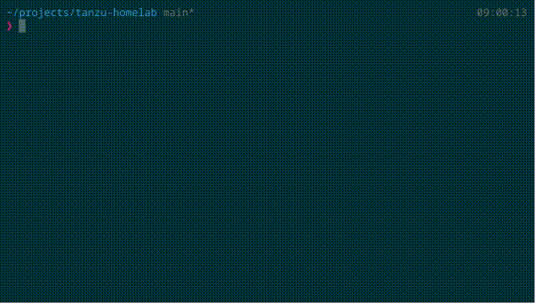

Lately I've been spending some time [getting more familiar](/tanzu-community-edition-k8s-homelab/) with VMware's [Tanzu Community Edition](https://tanzucommunityedition.io/) Kubernetes distribution, but I'm still not quite familiar enough with the `tanzu` command line. If only there were a better way for me to discover the available commands for a given context and help me type them correctly...

Oh, but there is! You see, one of the available Tanzu commands is `tanzu completion [shell]`, which will spit out the necessary code to generate handy context-based auto-completions appropriate for the shell of your choosing (provided that you choose either `bash` or `zsh`, that is).

Running `tanzu completion --help` will tell you what's needed, and you can just copy/paste the commands appropriate for your shell:

```shell
# Bash instructions:

  ## Load only for current session:
  source <(tanzu completion bash)

  ## Load for all new sessions:
  tanzu completion bash >  $HOME/.tanzu/completion.bash.inc
  printf "\n# Tanzu shell completion\nsource '$HOME/.tanzu/completion.bash.inc'\n" >> $HOME/.bash_profile

# Zsh instructions:

  ## Load only for current session:
  source <(tanzu completion zsh)

  ## Load for all new sessions:
  echo "autoload -U compinit; compinit" >> ~/.zshrc
  tanzu completion zsh > "${fpath[1]}/_tanzu"
```

So to get the completions to load automatically whenever you start a `bash` shell, run:
```command
tanzu completion bash >  $HOME/.tanzu/completion.bash.inc
printf "\n# Tanzu shell completion\nsource '$HOME/.tanzu/completion.bash.inc'\n" >> $HOME/.bash_profile
```

For a `zsh` shell, it's:
```command
echo "autoload -U compinit; compinit" >> ~/.zshrc
tanzu completion zsh > "${fpath[1]}/_tanzu"
```

And that's it! The next time you open a shell (or `source` your relevant profile), you'll be able to `[TAB]` your way through the Tanzu CLI!


