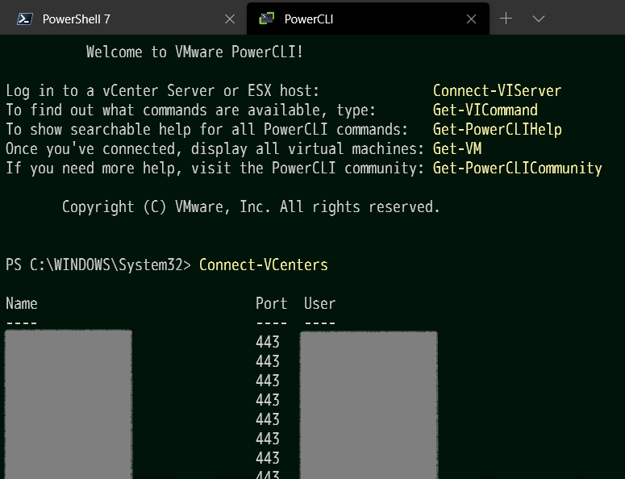

I manage a large VMware environment spanning several individual vCenters, and I often need to run [PowerCLI](https://code.vmware.com/web/tool/12.0.0/vmware-powercli) queries across the entire environment. I waste valuable seconds running `Connect-ViServer` and logging in for each and every vCenter I need to talk to. Wouldn't it be great if I could just log into all of them at once?

I can, and here's how I do it.



### The Script
The following Powershell script will let you define a list of vCenters to be accessed, securely store your credentials for each vCenter, log in to every vCenter with a single command, and also close the connections when they're no longer needed. It's also a great starting point for any other custom functions you'd like to incorporate into your PowerCLI sessions.
```powershell {linenos=true}
# PowerCLI_Custom_Functions.ps1
# Usage:
#   0) Edit $vCenterList to reference the vCenters in your environment.
#   1) Call 'Update-Credentials' to create/update a ViCredentialStoreItem to securely store your username and password.
#   2) Call 'Connect-vCenters' to open simultaneously connections to all the vCenters in your environment.
#   3) Do PowerCLI things.
#   4) Call 'Disconnect-vCenters' to cleanly close all ViServer connections because housekeeping.
Import-Module VMware.PowerCLI

$vCenterList = @("vcenter1", "vcenter2", "vcenter3", "vcenter4", "vcenter5")

function Update-Credentials {
    $newCredential = Get-Credential
    ForEach ($vCenter in $vCenterList) {
        New-ViCredentialStoreItem -Host $vCenter -User $newCredential.UserName -Password $newCredential.GetNetworkCredential().password
    }
}

function Connect-vCenters {
    ForEach ($vCenter in $vCenterList) {
        Connect-ViServer -Server $vCenter
    }
}

function Disconnect-vCenters {
    Disconnect-ViServer -Server * -Force -Confirm:$false
}
```
### The Setup
Edit whatever shortcut you use for launching PowerCLI (I use a tab in [Windows Terminal](https://github.com/microsoft/terminal) - I'll do another post on that setup later) to reference the custom init script. Here's the commandline I use:
```powershell
powershell.exe -NoExit -Command ". C:\Scripts\PowerCLI_Custom_Functions.ps1"
```
### The Usage
Now just use that shortcut to open up PowerCLI when you wish to do things. The custom functions will be loaded and waiting for you.
1. Start by running `Update-Credentials`. It will prompt you for the username+password needed to log into each vCenter listed in `$vCenterList`. These can be the same or different accounts, but you will need to enter the credentials for each vCenter since they get stored in a separate `ViCredentialStoreItem`. You'll also run this function again if you need to change the password(s) in the future.
2. Log in to all the things by running `Connect-vCenters`.
3. Do your work.
4. When you're finished, be sure to call `Disconnect-vCenters` so you don't leave sessions open in the background.
