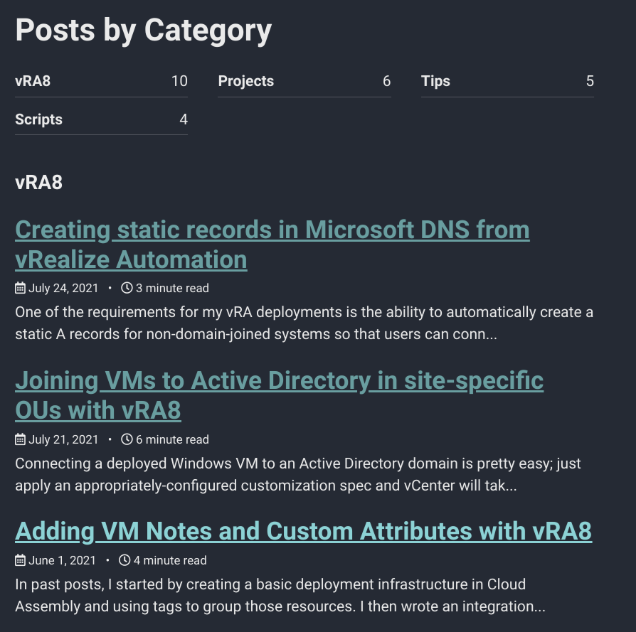
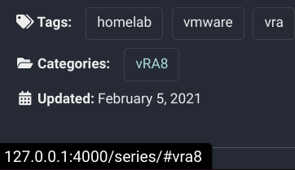
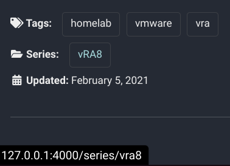
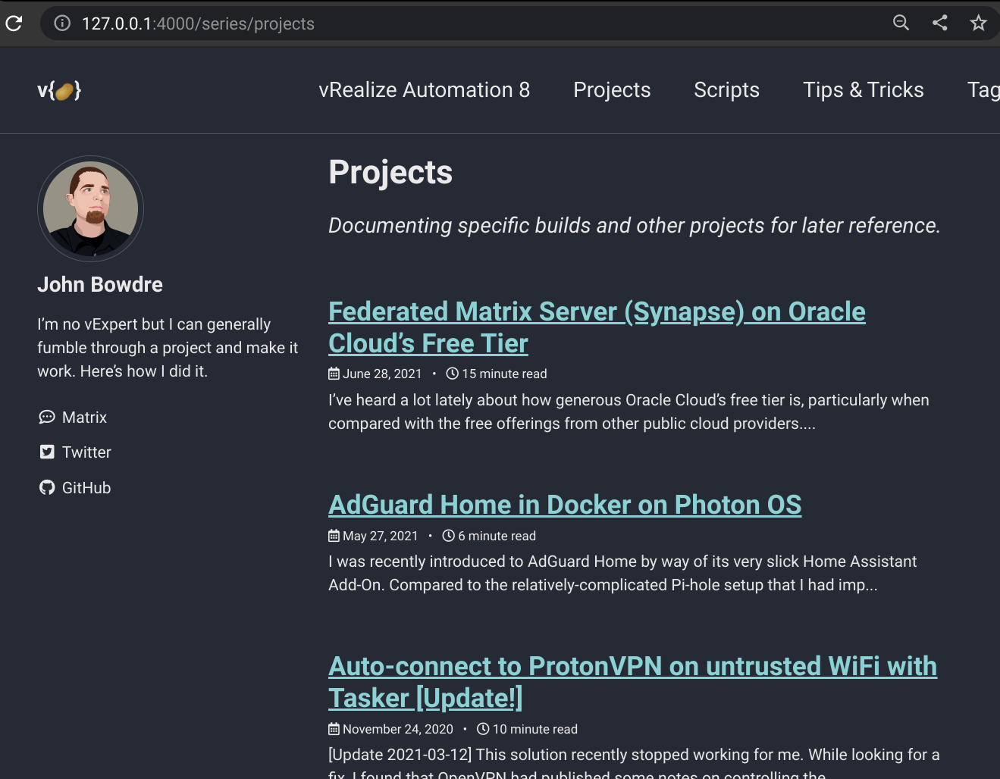

I recently [migrated this site](/virtually-potato-migrated-to-github-pages) from Hashnode to GitHub Pages, and I'm really getting into the flexibility and control that managing the content through Jekyll provides. So, naturally, after finalizing the move I got to work recreating Hashnode's "Series" feature, which lets you group posts together and highlight them as a collection. One of the things I liked about the Series setup was that I could control the order of the collected posts: my posts about [building out the vRA environment in my homelab](/series/vra8) are probably best consumed in chronological order (oldest to newest) since the newer posts build upon the groundwork laid by the older ones, while posts about my [other one-off projects](/series/projects) could really be enjoyed in any order.

I quickly realized that if I were hosting this pretty much anywhere *other* than GitHub Pages I could simply leverage the [`jekyll-archives`](https://github.com/jekyll/jekyll-archives) plugin to manage this for me - but, alas, that's not one of the [plugins supported by the platform](https://pages.github.com/versions/). I needed to come up with my own solution, and being still quite new to Jekyll (and this whole website design thing in general) it took me a bit of fumbling to get it right.

### Reviewing the theme-provided option
The Jekyll theme I'm using ([Minimal Mistakes](https://github.com/mmistakes/minimal-mistakes)) comes with [built-in support](https://mmistakes.github.io/mm-github-pages-starter/categories/) for a [category archive page](/series), which (like the [tags page](/tags)) displays all the categorized posts on a single page. Links at the top will let you jump to an appropriate anchor to start viewing the selected category, but it's not really an elegant way to display a single category.


It's a start, though, so I took a few minutes to check out how it's being generated. The category archive page lives at [`_pages/category-archive.md`](https://raw.githubusercontent.com/mmistakes/mm-github-pages-starter/master/_pages/category-archive.md):
```markdown {linenos=true}
---
title: "Posts by Category"
layout: categories
permalink: /categories/
author_profile: true
---
```

The `title` indicates what's going to be written in bold text at the top of the page, the `permalink` says that it will be accessible at `http://localhost/categories/`, and the nice little `author_profile` sidebar will appear on the left.

This page then calls the `categories` layout, which is defined in [`_layouts/categories.html`](https://github.com/mmistakes/minimal-mistakes/blob/master/_layouts/categories.html):
```liquid {linenos=true}
---
layout: archive
---

{{ content }}



  
    
  


<ul class="taxonomy__index">
  
    
      
        <li>
          <a href="#{{ category[0] | slugify }}">
            <strong>{{ category[0] }}</strong> <span class="taxonomy__count">{{ i }}</span>
          </a>
        </li>
      
    
  
</ul>



  
    
      <section id="{{ category[0] | slugify | downcase }}" class="taxonomy__section">
        <h2 class="archive__subtitle">{{ category[0] }}</h2>
        <div class="entries-{{ entries_layout }}">
          
            
          
        </div>
        <a href="#page-title" class="back-to-top">{{ site.data.ui-text[site.locale].back_to_top | default: 'Back to Top' }} &uarr;</a>
      </section>
    
  

```

I wanted my solution to preserve the formatting that's used by the theme elsewhere on this site so this bit is going to be my base. The big change I'll make is that instead of enumerating all of the categories on one page, I'll have to create a new static page for each of the categories I'll want to feature. And each of those pages will refer to a new layout to determine what will actually appear on the page.

### Defining a new layout
I create a new file called `_layouts/series.html` which will define how these new series pages get rendered. It starts out just like the default `categories.html` one:

```liquid {linenos=true}
---
layout: archive
---

{{ content }}
```

That `{{ content }}` block will let me define text to appear above the list of articles - very handy. Much of the original `categories.html` code has to do with iterating through the list of categories. I won't need that, though, so I'll jump straight to setting what layout the entries on this page will use:
```liquid

```

I'll be including two custom variables in the [Front Matter](https://jekyllrb.com/docs/front-matter/) for my category pages: `tag` to specify what category to filter on, and `sort_order` which will be set to `reverse` if I want the older posts up top. I'll be able to access these in the layout as `page.tag` and `page.sort_order`, respectively. So I'll go ahead and grab all the posts which are categorized with `page.tag`, and then decide whether the posts will get sorted normally or in reverse:
```liquid {linenos=true}


    

```

And then I'll loop through each post (in either normal or reverse order) and insert them into the rendered page:
```liquid {linenos=true}
<div class="entries-{{ entries_layout }}">
    
        
    
</div>
```

Putting it all together now, here's my new `_layouts/series.html` file:
```liquid {linenos=true}
---
layout: archive
---

{{ content }}




    

<div class="entries-{{ entries_layout }}">
    
        
    
</div>
```

### Series pages
Since I can't use a plugin to automatically generate pages for each series, I'll have to do it manually. Fortunately this is pretty easy, and I've got a limited number of categories/series to worry about. I started by making a new `_pages/series-vra8.md` and setting it up thusly:
```markdown {linenos=true}
---
title: "Adventures in vRealize Automation 8"
layout: series
permalink: "/series/vra8"
tag: vRA8
sort_order: reverse
author_profile: true
header:
    teaser: assets/images/posts-2020/RtMljqM9x.png
---

*Follow along as I create a flexible VMware vRealize Automation 8 environment for provisioning virtual machines - all from the comfort of my Intel NUC homelab.*
```

You can see that this page is referencing the series layout I just created, and it's going to live at `http://localhost/series/vra8` - precisely where this series was on Hashnode. I've tagged it with the category I want to feature on this page, and specified that the posts will be sorted in reverse order so that anyone reading through the series will start at the beginning (I hear it's a very good place to start). I also added a teaser image which will be displayed when I link to the series from elsewhere. And I included a quick little italicized blurb to tell readers what the series is about.

Check it out [here](/series/vra8):


The other series pages will be basically the same, just without the reverse sort directive. Here's `_pages/series-tips.md`:
```markdown {linenos=true}
---
title: "Tips & Tricks"
layout: series
permalink: "/series/tips"
tag: Tips
author_profile: true
header:
    teaser: assets/images/posts-2020/kJ_l7gPD2.png
---

*Useful tips and tricks I've stumbled upon.*
```

### Changing the category permalink
Just in case someone wants to look at all the post series in one place, I'll be keeping the existing category archive page around, but I'll want it to be found at `/series/` instead of `/categories/`. I'll start with going into the `_config.yml` file and changing the `category_archive` path:

```yaml {linenos=true}
category_archive:
  type: liquid
  # path: /categories/
  path: /series/
tag_archive:
  type: liquid
  path: /tags/
```

I'll also rename `_pages/category-archive.md` to `_pages/series-archive.md` and update its title and permalink:
```markdown {linenos=true}
---
title: "Posts by Series"
layout: categories
permalink: /series/
author_profile: true
---
```

### Fixing category links in posts
The bottom of each post has a section which lists the tags and categories to which it belongs. Right now, those are still pointing to the category archive page (`/series/#vra8`) instead of the series feature pages I created (`/series/vra8`).


That *works* but I'd rather it reference the fancy new pages I created. Tracking down where to make that change was a bit of a journey.

I started with the [`_layouts/single.html`](https://github.com/mmistakes/minimal-mistakes/blob/master/_layouts/single.html) file which is the layout I'm using for individual posts. This bit near the end gave me the clue I needed:
```liquid {linenos=true}
      <footer class="page__meta">
        
          <h4 class="page__meta-title">{{ site.data.ui-text[site.locale].meta_label }}</h4>
        
        
        
      </footer>
```

It looks like [`page__taxonomy.html`](https://github.com/mmistakes/minimal-mistakes/blob/master/_includes/page__taxonomy.html) is being used to display the tags and categories, so I then went to that file in the `_include` directory:
```liquid {linenos=true}

  



  

```

Okay, it looks like [`_include/category-list.html`](https://github.com/mmistakes/minimal-mistakes/blob/master/_includes/category-list.html) is what I actually want. Here's that file:
```liquid {linenos=true}

  
    
  
    



  

  <p class="page__taxonomy">
    <strong><i class="fas fa-fw fa-folder-open" aria-hidden="true"></i> {{ site.data.ui-text[site.locale].categories_label | default: "series:" }} </strong>
    <span itemprop="keywords">
    
      <a href="{{ category_word | slugify | prepend: path_type | prepend: site.category_archive.path | relative_url }}" class="page__taxonomy-item p-category" rel="tag">{{ category_word }}</a><span class="sep">, </span>
    
    </span>
  </p>

```

I'm using the `liquid` archive approach since I can't use the `jekyll-archives` plugin, so I can see that it's setting the `path_type` to `"#"`. And near the bottom of the file, I can see that it's assembling the category link by slugifying the `category_word`, sticking the `path_type` in front of it, and then putting the `site.category_archive.path` (which I edited earlier in `_config.yml`) in front of that. So that's why my category links look like `/series/#category`. I can just edit the top of this file to statically set `path_type = nil` and that should clear this up in a jiffy:
```liquid {linenos=true}


  
  [...]
```

To sell the series illusion even further, I can pop into [`_data/ui-text.yml`](https://github.com/mmistakes/minimal-mistakes/blob/master/_data/ui-text.yml) to update the string used for `categories_label`:
```yaml {linenos=true}
  meta_label                 :
  tags_label                 : "Tags:"
  categories_label           : "Series:"
  date_label                 : "Updated:"
  comments_label             : "Leave a comment"
```


Much better!

### Updating the navigation header
And, finally, I'll want to update the navigation links at the top of each page to help visitors find my new featured series pages. For that, I can just edit `_data/navigation.yml` with links to my new pages:
```yaml {linenos=true}
main:
  - title: "vRealize Automation 8"
    url: /series/vra8
  - title: "Projects"
    url: /series/projects
  - title: "Scripts"
    url: /series/scripts
  - title: "Tips & Tricks"
    url: /series/tips
  - title: "Tags"
    url: /tags/
  - title: "All Posts"
    url: /posts/
```

### All done!


I set out to recreate the series setup that I had over at Hashnode, and I think I've accomplished that. More importantly, I've learned quite a bit more about how Jekyll works, and I'm already plotting further tweaks. For now, though, I think this is ready for a `git push`!