Back in October, VMware [announced](https://tanzu.vmware.com/content/blog/vmware-tanzu-community-edition-announcement) [Tanzu Community Edition](https://tanzucommunityedition.io/) as way to provide "a full-featured, easy-to-manage Kubernetes platform that’s perfect for users and learners alike." TCE bundles a bunch of open-source components together in a modular, "batteries included but swappable" way:
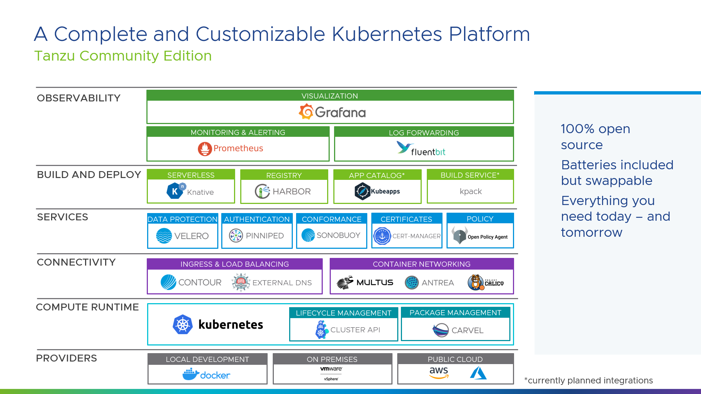

I've been meaning to brush up on my Kubernetes skills so I thought deploying and using TCE in my self-contained [homelab](/vmware-home-lab-on-intel-nuc-9/) would be a fun and rewarding learning exercise - and it was!

Here's how I did it.

### Planning
TCE supports several different deployment scenarios and targets. It can be configured as separate Management and Workload Clusters or as a single integrated Standalone Cluster, and deployed to cloud providers like AWS and Azure, on-premise vSphere, or even a local Docker environment[^yo_dawg]. I'll be using the standard Management + Workload Cluster setup in my on-prem vSphere, so I start by reviewing the [Prepare to Deploy a Cluster to vSphere](https://tanzucommunityedition.io/docs/latest/vsphere/) documentation to get an idea of what I'll need.

Looking ahead, part of the installation process creates a local [KIND](https://kind.sigs.k8s.io/) cluster for bootstrapping the Management and Workload clusters. I do most of my home computing (and homelab work) by using the [Linux environment available on my Chromebook](/setting-up-linux-on-a-new-lenovo-chromebook-duet-bonus-arm64-complications/). Unfortunately I know from past experience that KIND will not work within this environment so I'll be using a Debian 10 VM to do the deployment.

[^yo_dawg]: Yo dawg, I heard you like containers...

#### Networking
The Kubernetes node VMs will need to be attached to a network with a DHCP server to assign their addresses, and that network will need to be able to talk to vSphere. My router handles DHCP for the range `192.168.1.101-250` so I'll plan on using that.

I'll also need to set aside a few static IPs for this project. These will need to be routable and within the same subnet as the DHCP range, but excluded from that DHCP range.

| IP Address | Purpose |
| --- | --- |
| `192.168.1.60` | Control plane for Management cluster |
| `192.168.1.61` | Control plane for Workload cluster |
| `192.168.1.64 - 192.168.1.80` | IP range for Workload load balancer |


### Prerequisites
Moving on to the [Getting Started](https://tanzucommunityedition.io/docs/latest/getting-started/), I'll need to grab some software before I can actually Get Started.

#### Kubernetes control plane image
I need to download a VMware OVA which can be used for deploying my Kubernetes nodes from the VMWare Customer Connect portal [here](https://customerconnect.vmware.com/downloads/get-download?downloadGroup=TCE-090)[^register]. There are a few different options available. I'll get the Photon release with the highest Kubernetes version currently available, `photon-3-kube-v1.21.2+vmware.1-tkg.2-12816990095845873721.ova`.

Once the file is downloaded, I'll log into my vCenter and use the **Deploy OVF Template** action to deploy a new VM using the OVA. I won't bother booting the machine once deployed but will rename it to `k8s-node` to make it easier to identify later on and then convert it to a template.


[^register]: Register [here](https://customerconnect.vmware.com/account-registration) if you don't yet have an account.

#### Docker
I've already got Docker installed on this machine, but if I didn't I would follow the instructions [here](https://docs.docker.com/engine/install/debian/) to get it installed and then follow [these instructions](https://docs.docker.com/engine/install/linux-postinstall/#manage-docker-as-a-non-root-user) to enable management of Docker without root.

I also verify that my install is using `cgroup` version 1 as version 2 is not currently supported:

```command-session
docker info | grep -i cgroup
 Cgroup Driver: cgroupfs
 Cgroup Version: 1
```

#### `kubectl` binary
Next up, I'll install `kubectl` [as described here](https://kubernetes.io/docs/tasks/tools/install-kubectl-linux/) - though the latest version is currently `1.23` and that won't work with the `1.21` control plane node image I downloaded from VMware (`kubectl` needs to be within one minor version of the control plane). Instead I need to find the latest `1.22` release.

I can look at the [releases page on GithHub](https://github.com/kubernetes/kubernetes/releases) to see that the latest release for me is `1.22.5`. With this newfound knowledge I can follow the [Install kubectl binary with curl on Linux](https://kubernetes.io/docs/tasks/tools/install-kubectl-linux/#install-kubectl-binary-with-curl-on-linux) instructions to grab that specific version:

```command-session
curl -LO https://dl.k8s.io/release/v1.22.5/bin/linux/amd64/kubectl

  % Total    % Received % Xferd  Average Speed   Time    Time     Time  Current
                                 Dload  Upload   Total   Spent    Left  Speed
100   154  100   154    0     0   2298      0 --:--:-- --:--:-- --:--:--  2298
100 44.7M  100 44.7M    0     0  56.9M      0 --:--:-- --:--:-- --:--:-- 56.9M
```
```command-session
sudo install -o root -g root -m 0755 kubectl /usr/local/bin/kubectl

[sudo] password for john:
```
```command-session
kubectl version --client
Client Version: version.Info{Major:"1", Minor:"22", GitVersion:"v1.22.5", GitCommit:"5c99e2ac2ff9a3c549d9ca665e7bc05a3e18f07e", GitTreeState:"clean", BuildDate:"2021-12-16T08:38:33Z", GoVersion:"go1.16.12", Compiler:"gc", Platform:"linux/amd64"}
```

#### `kind` binary
It's not strictly a requirement, but having the `kind` executable available will be handy for troubleshooting during the bootstrap process in case anything goes sideways. It can be installed in basically the same was as `kubectl`:

```command-session
curl -Lo ./kind https://kind.sigs.k8s.io/dl/v0.11.1/kind-linux-amd64

  % Total    % Received % Xferd  Average Speed   Time    Time     Time  Current
                                 Dload  Upload   Total   Spent    Left  Speed
100    98  100    98    0     0    513      0 --:--:-- --:--:-- --:--:--   513
100   655  100   655    0     0   2212      0 --:--:-- --:--:-- --:--:-- 10076
100 6660k  100 6660k    0     0  11.8M      0 --:--:-- --:--:-- --:--:-- 11.8M
```
```command
sudo install -o root -g root -m 0755 kind /usr/local/bin/kind
```
```command-session
kind version
kind v0.11.1 go1.16.5 linux/amd64
```

#### Tanzu CLI
The final bit of required software is the Tanzu CLI, which can be downloaded from the [project on GitHub](https://github.com/vmware-tanzu/community-edition/releases).

```command-session
curl -H "Accept: application/vnd.github.v3.raw" \
  -L https://api.github.com/repos/vmware-tanzu/community-edition/contents/hack/get-tce-release.sh | \
  bash -s v0.9.1 linux
```

And then unpack it and run the installer:
```command
tar xf tce-linux-amd64-v0.9.1.tar.gz
cd tce-linux-amd64-v0.9.1
./install.sh
```

I can then verify the installation is working correctly:
```command-session
tanzu version
version: v0.2.1
buildDate: 2021-09-29
sha: ceaa474
```

### Cluster creation
Okay, now it's time for the good stuff - creating some shiny new Tanzu clusters! The Tanzu CLI really does make this very easy to accomplish.

#### Management cluster
I need to create a Management cluster first and I'd like to do that with the UI, so that's as simple as:
```command
tanzu management-cluster create --ui
```

I should then be able to access the UI by pointing a web browser at `http://127.0.0.1:8080`... but I'm running this on a VM without a GUI, so I'll need to back up and tell it to bind on `0.0.0.0:8080` so the web installer will be accessible across the network. I can also include `--browser none` so that the installer doesn't bother with trying to launch a browser locally.

```command-session
tanzu management-cluster create --ui --bind 0.0.0.0:8080 --browser none

Validating the pre-requisites...
Serving kickstart UI at http://[::]:8080
```

*Now* I can point my local browser to my VM and see the UI:


And then I can click the button at the bottom left to save my eyes[^dark_mode] before selecting the option to deploy on vSphere.
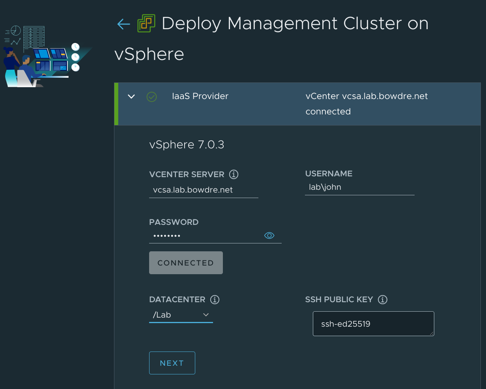

I'll plug in the FQDN of my vCenter and provide a username and password to use to connect to it, then hit the **Connect** button. That will prompt me to accept the vCenter's certificate thumbprint, and then I'll be able to select the virtual datacenter that I want to use. Finally, I'll paste in the SSH public key[^gen_key] I'll use for interacting with the cluster.

I click **Next** and move on to the Management Cluster Settings.
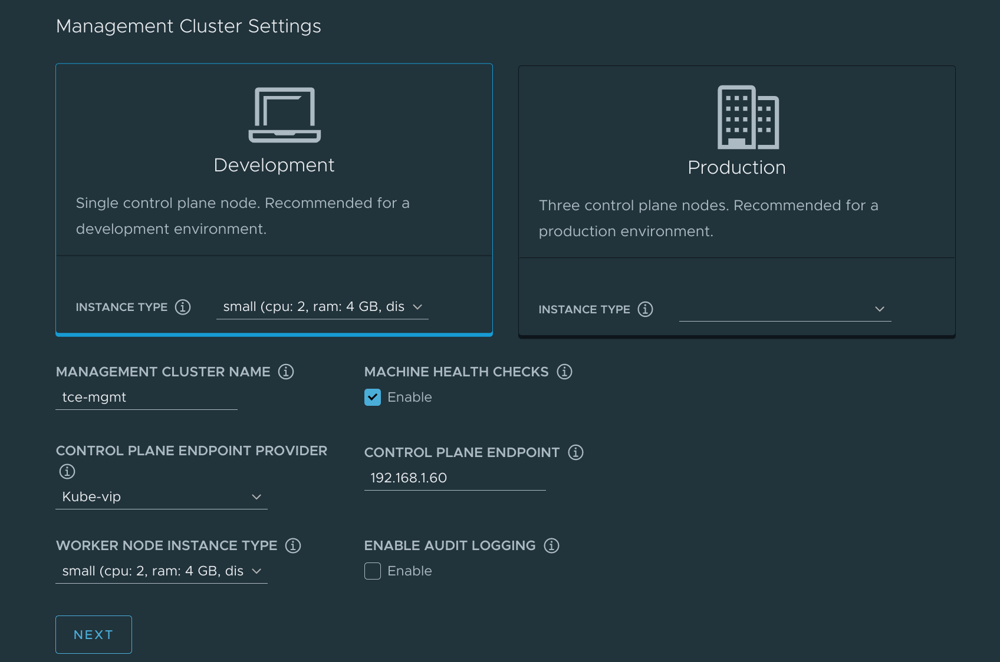

This is for a lab environment that's fairly memory-constrained, so I'll pick the single-node *Development* setup with a *small* instance type. I'll name the cluster `tce-mgmt` and stick with the default `kube-vip` control plane endpoint provider. I plug in the control plane endpoint IP that I'll use for connecting to the cluster and select the *small* instance type for the worker node type.

I don't have an NSX Advanced Load Balancer or any Metadata to configure so I'll skip past those steps and move on to configuring the Resources.
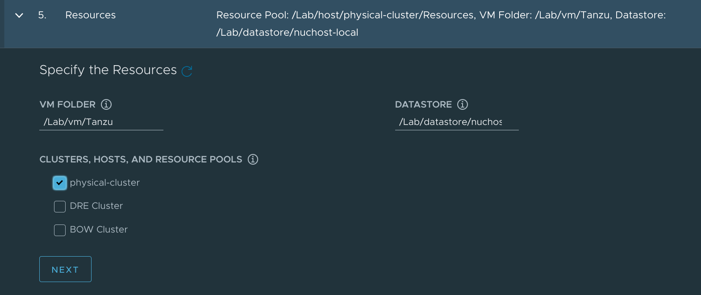

Here I pick to place the Tanzu-related resources in a VM folder named `Tanzu`, to store their data on my single host's single datastore, and to deploy to the one-host `physical-cluster` cluster.

Now for the Kubernetes Networking Settings:


This bit is actually pretty easy. For Network Name, I select the vSphere network where the `192.168.1.0/24` network I identified earlier lives, `d-Home-Mgmt`. I leave the service and pod CIDR ranges as default.

I disable the Identity Management option and then pick the `k8s-node` template I had imported to vSphere earlier.


I skip the Tanzu Mission Control piece (since I'm still waiting on access to [TMC Starter](https://tanzu.vmware.com/tmc-starter)) and click the **Review Configuration** button at the bottom of the screen to review my selections.
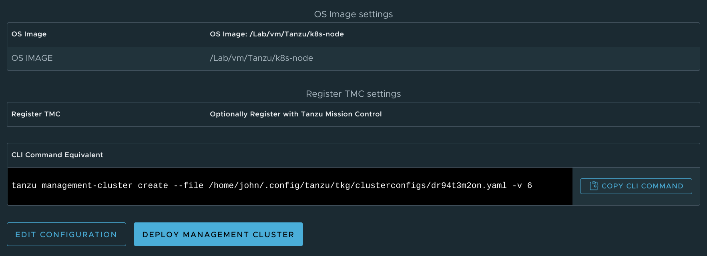

See the option at the bottom to copy the CLI command? I'll need to use that since clicking the friendly **Deploy** button doesn't seem to work while connected to the web server remotely.

```command
tanzu management-cluster create --file /home/john/.config/tanzu/tkg/clusterconfigs/dr94t3m2on.yaml -v 6
```

In fact, I'm going to copy that file into my working directory and give it a more descriptive name so that I can re-use it in the future.

```command
cp ~/.config/tanzu/tkg/clusterconfigs/dr94t3m2on.yaml ~/projects/tanzu-homelab/tce-mgmt.yaml
```

Now I can run the install command:

```command
tanzu management-cluster create --file ./tce-mgmt.yaml -v 6
```

After a moment or two of verifying prerequisites, I'm met with a polite offer to enable Tanzu Kubernetes Grid Service in vSphere:

```
vSphere 7.0 Environment Detected.

You have connected to a vSphere 7.0 environment which does not have vSphere with Tanzu enabled. vSphere with Tanzu includes
an integrated Tanzu Kubernetes Grid Service which turns a vSphere cluster into a platform for running Kubernetes workloads in dedicated
resource pools. Configuring Tanzu Kubernetes Grid Service is done through vSphere HTML5 client.

Tanzu Kubernetes Grid Service is the preferred way to consume Tanzu Kubernetes Grid in vSphere 7.0 environments. Alternatively you may
deploy a non-integrated Tanzu Kubernetes Grid instance on vSphere 7.0.
Note: To skip the prompts and directly deploy a non-integrated Tanzu Kubernetes Grid instance on vSphere 7.0, you can set the 'DEPLOY_TKG_ON_VSPHERE7' configuration variable to 'true'

Do you want to configure vSphere with Tanzu? [y/N]: n
Would you like to deploy a non-integrated Tanzu Kubernetes Grid management cluster on vSphere 7.0? [y/N]: y
```

That's not what I'm after in this case, though, so I'll answer with a `n` and a `y` to confirm that I want the non-integrated TKG deployment.

And now I go get coffee as it'll take 10-15 minutes for the deployment to complete.


Okay, I'm back - and so is my shell prompt! The deployment completed successfully:
```
Waiting for additional components to be up and running...
Waiting for packages to be up and running...
Context set for management cluster tce-mgmt as 'tce-mgmt-admin@tce-mgmt'.

Management cluster created!


You can now create your first workload cluster by running the following:

  tanzu cluster create [name] -f [file]


Some addons might be getting installed! Check their status by running the following:

  kubectl get apps -A

```

I can run that last command to go ahead and verify that the addon installation has completed:

```command-session
kubectl get apps -A
NAMESPACE    NAME                   DESCRIPTION           SINCE-DEPLOY   AGE
tkg-system   antrea                 Reconcile succeeded   26s            6m49s
tkg-system   metrics-server         Reconcile succeeded   36s            6m49s
tkg-system   tanzu-addons-manager   Reconcile succeeded   22s            8m54s
tkg-system   vsphere-cpi            Reconcile succeeded   19s            6m50s
tkg-system   vsphere-csi            Reconcile succeeded   36s            6m50s
```

And I can use the Tanzu CLI to get some other details about the new management cluster:
```command-session
tanzu management-cluster get tce-mgmt
  NAME      NAMESPACE   STATUS   CONTROLPLANE  WORKERS  KUBERNETES        ROLES
  tce-mgmt  tkg-system  running  1/1           1/1      v1.21.2+vmware.1  management


Details:

NAME                                                         READY  SEVERITY  REASON  SINCE  MESSAGE
/tce-mgmt                                                    True                     40m
├─ClusterInfrastructure - VSphereCluster/tce-mgmt            True                     41m
├─ControlPlane - KubeadmControlPlane/tce-mgmt-control-plane  True                     40m
│ └─Machine/tce-mgmt-control-plane-xtdnx                     True                     40m
└─Workers
  └─MachineDeployment/tce-mgmt-md-0
    └─Machine/tce-mgmt-md-0-745b858d44-4c9vv                 True                     40m


Providers:

  NAMESPACE                          NAME                    TYPE                    PROVIDERNAME  VERSION  WATCHNAMESPACE
  capi-kubeadm-bootstrap-system      bootstrap-kubeadm       BootstrapProvider       kubeadm       v0.3.23
  capi-kubeadm-control-plane-system  control-plane-kubeadm   ControlPlaneProvider    kubeadm       v0.3.23
  capi-system                        cluster-api             CoreProvider            cluster-api   v0.3.23
  capv-system                        infrastructure-vsphere  InfrastructureProvider  vsphere       v0.7.10
```


Excellent! Things are looking good so I can move on to create the cluster which will actually run my workloads.

[^dark_mode]: Enabling dark mode is probably the most important part of this process.
[^gen_key]: If I didn't already have a key pair to use I would generate one with `ssh-keygen -t rsa -b 4096 -C "email@example.com"` and add it to my client with `ssh-add ~/.ssh/id_rsa`.
#### Workload cluster
I won't use the UI for this but will instead take a copy of my `tce-mgmt.yaml` file and adapt it to suit the workload needs (as described [here](https://tanzucommunityedition.io/docs/latest/workload-clusters/)).

```command
cp tce-mgmt.yaml tce-work.yaml
vi tce-work.yaml
```

I only need to change 2 of the parameters in this file:
- `CLUSTER_NAME`: from `tce-mgmt` to `tce-work`
- `VSPHERE_CONTROL_PLANE_ENDPOINT`: from `192.168.1.60` to `192.168.1.61`

I *could* change a few others if I wanted to[^i_wont]:
- (Optional) `CLUSTER_PLAN` to change between `dev`/`prod` plans independently
- (Optional) `CONTROL_PLANE_MACHINE_COUNT` to deploy an increased number of control plane nodes (must but an odd integer)
- (Optional) `WORKER_MACHINE_COUNT` to add worker nodes
- (Optional) `NAMESPACE` to deploy the cluster in a specific Kubernetes namespace
- (Optional) `OS_NAME` and `OS_VERSION` to use a different machine image for the workload cluster

After saving my changes to the `tce-work.yaml` file, I'm ready to deploy the cluster:

```command-session
tanzu cluster create --file tce-work.yaml
Validating configuration...
Warning: Pinniped configuration not found. Skipping pinniped configuration in workload cluster. Please refer to the documentation to check if you can configure pinniped on workload cluster manually
Creating workload cluster 'tce-work'...
Waiting for cluster to be initialized...
Waiting for cluster nodes to be available...
Waiting for addons installation...
Waiting for packages to be up and running...

Workload cluster 'tce-work' created
```

Right on! I'll use `tanzu cluster get` to check out the workload cluster:
```command-session
tanzu cluster get tce-work
  NAME      NAMESPACE  STATUS   CONTROLPLANE  WORKERS  KUBERNETES        ROLES
  tce-work  default    running  1/1           1/1      v1.21.2+vmware.1  <none>
ℹ

Details:

NAME                                                         READY  SEVERITY  REASON  SINCE  MESSAGE
/tce-work                                                    True                     9m31s
├─ClusterInfrastructure - VSphereCluster/tce-work            True                     10m
├─ControlPlane - KubeadmControlPlane/tce-work-control-plane  True                     9m31s
│ └─Machine/tce-work-control-plane-8km9m                     True                     9m31s
└─Workers
  └─MachineDeployment/tce-work-md-0
    └─Machine/tce-work-md-0-687444b744-cck4x                 True                     8m31s
```

I can also go into vCenter and take a look at the VMs which constitute the two clusters:
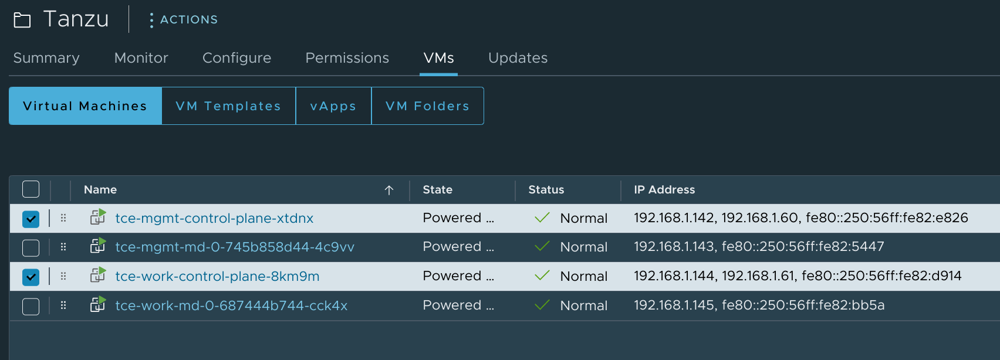

I've highlighted the two Control Plane nodes. They got their IP addresses assigned by DHCP, but [VMware says](https://tanzucommunityedition.io/docs/latest/verify-deployment/#configure-dhcp-reservations-for-the-control-plane-nodes-vsphere-only) that I need to create reservations for them to make sure they don't change. So I'll do just that.
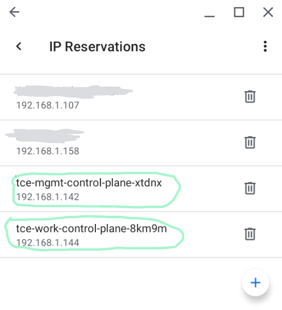

Excellent, I've got a Tanzu management cluster and a Tanzu workload cluster. What now?

[^i_wont]: I'm not going to, but I totally could.

### Working with Tanzu

If I run `kubectl get nodes` right now, I'll only get information about the management cluster:

```command-session
kubectl get nodes
NAME                             STATUS   ROLES                  AGE   VERSION
tce-mgmt-control-plane-xtdnx     Ready    control-plane,master   18h   v1.21.2+vmware.1
tce-mgmt-md-0-745b858d44-4c9vv   Ready    <none>                 17h   v1.21.2+vmware.1
```

#### Setting the right context
To be able to deploy stuff to the workload cluster, I need to tell `kubectl` how to talk to it. And to do that, I'll first need to use `tanzu` to capture the cluster's kubeconfig:

```command-session
tanzu cluster kubeconfig get tce-work --admin
Credentials of cluster 'tce-work' have been saved
You can now access the cluster by running 'kubectl config use-context tce-work-admin@tce-work'
```

I can now run `kubectl config get-contexts` and see that I have access to contexts on both management and workload clusters:

```command-session
kubectl config get-contexts
CURRENT   NAME                      CLUSTER    AUTHINFO         NAMESPACE
*         tce-mgmt-admin@tce-mgmt   tce-mgmt   tce-mgmt-admin
          tce-work-admin@tce-work   tce-work   tce-work-admin
```

And I can switch to the `tce-work` cluster like so:

```command-session
kubectl config use-context tce-work-admin@tce-work
Switched to context "tce-work-admin@tce-work".
```
```command-session
kubectl get nodes
NAME                             STATUS   ROLES                  AGE   VERSION
tce-work-control-plane-8km9m     Ready    control-plane,master   17h   v1.21.2+vmware.1
tce-work-md-0-687444b744-cck4x   Ready    <none>                 17h   v1.21.2+vmware.1
```

There they are!

#### Deploying the `yelb` demo app
Before I move on to deploying actually *useful* workloads, I'll start with deploying a quick demo application as described in William Lam's post on [Interesting Kubernetes application demos](https://williamlam.com/2020/06/interesting-kubernetes-application-demos.html). `yelb` is a web app which consists of a UI front end, application server, database server, and Redis caching service so it's a great little demo to make sure Kubernetes is working correctly.

I can check out the sample deployment that William put together [here](https://github.com/lamw/vmware-k8s-app-demo/blob/master/yelb.yaml), and then deploy it with:

```command-session
kubectl create ns yelb
namespace/yelb created
```
```command-session
kubectl apply -f https://raw.githubusercontent.com/lamw/vmware-k8s-app-demo/master/yelb.yaml
service/redis-server created
service/yelb-db created
service/yelb-appserver created
service/yelb-ui created
deployment.apps/yelb-ui created
deployment.apps/redis-server created
deployment.apps/yelb-db created
deployment.apps/yelb-appserver created
```
```command-session
kubectl -n yelb get pods
NAME                             READY   STATUS    RESTARTS   AGE
redis-server-74556bbcb7-r9jqc    1/1     Running   0          10s
yelb-appserver-d584bb889-2jspg   1/1     Running   0          10s
yelb-db-694586cd78-wb8tt         1/1     Running   0          10s
yelb-ui-8f54fd88c-k2dw9          1/1     Running   0          10s
```

Once the app is running, I can point my web browser at it to see it in action. But what IP do I use?

```command-session
kubectl -n yelb get svc/yelb-ui
NAME             TYPE        CLUSTER-IP       EXTERNAL-IP   PORT(S)        AGE
yelb-ui          NodePort    100.71.228.116   <none>        80:30001/TCP   84s
```

This demo is using a `NodePort` type service to expose the front end, which means it will be accessible on port `30001` on the node it's running on. I can find that IP by:
```command-session
kubectl -n yelb describe pod $(kubectl -n yelb get pods | grep yelb-ui | awk '{print $1}') | grep "Node:"
Node:         tce-work-md-0-687444b744-cck4x/192.168.1.145
```

So I can point my browser at `http://192.168.1.145:30001` and see the demo:
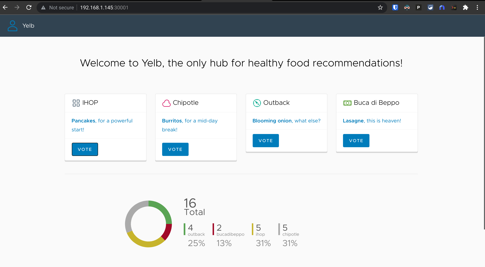

After marveling at my own magnificence[^magnificence] for a few minutes, I'm ready to move on to something more interesting - but first, I'll just delete the `yelb` namespace to clean up the work I just did:
```command-session
kubectl delete ns yelb
namespace "yelb" deleted
```

Now let's move on and try to deploy `yelb` behind a `LoadBalancer` service so it will get its own IP. William has a [deployment spec](https://github.com/lamw/vmware-k8s-app-demo/blob/master/yelb-lb.yaml) for that too.

```command-session
kubectl create ns yelb
namespace/yelb created
```
```command-session
kubectl apply -f https://raw.githubusercontent.com/lamw/vmware-k8s-app-demo/master/yelb-lb.yaml
service/redis-server created
service/yelb-db created
service/yelb-appserver created
service/yelb-ui created
deployment.apps/yelb-ui created
deployment.apps/redis-server created
deployment.apps/yelb-db created
deployment.apps/yelb-appserver created
```
```command-session
kubectl -n yelb get pods
NAME                             READY   STATUS    RESTARTS   AGE
redis-server-74556bbcb7-q6l62    1/1     Running   0          7s
yelb-appserver-d584bb889-p5qgd   1/1     Running   0          7s
yelb-db-694586cd78-hjtn4         1/1     Running   0          7s
yelb-ui-8f54fd88c-pm9qw          1/1     Running   0          7s
```

And I can take a look at that service...
```command-session
kubectl -n yelb get svc/yelb-ui
NAME      TYPE           CLUSTER-IP       EXTERNAL-IP   PORT(S)        AGE
yelb-ui   LoadBalancer   100.67.177.185   <pending>     80:32339/TCP   15s
```

Wait a minute. That external IP is *still* `<pending>`. What gives? Oh yeah I need to actually deploy and configure a load balancer before I can balance anything. That's up next.

[^magnificence]: Mr. Anderson.

#### Deploying `kube-vip` as a load balancer
Fortunately, William Lam [wrote up some tips](https://williamlam.com/2021/10/quick-tip-install-kube-vip-as-service-load-balancer-with-tanzu-community-edition-tce.html) for handling that too. It's [based on work by Scott Rosenberg](https://github.com/vrabbi/tkgm-customizations). The quick-and-dirty steps needed to make this work are:

```command
git clone https://github.com/vrabbi/tkgm-customizations.git
cd tkgm-customizations/carvel-packages/kube-vip-package
kubectl apply -n tanzu-package-repo-global -f metadata.yml
kubectl apply -n tanzu-package-repo-global -f package.yaml
```
```command-session
cat << EOF > values.yaml
vip_range: 192.168.1.64-192.168.1.80
EOF
```
```command
tanzu package install kubevip -p kubevip.terasky.com -v 0.3.9 -f values.yaml
```

Now I can check out the `yelb-ui` service again:
```command-session
kubectl -n yelb get svc/yelb-ui
NAME      TYPE           CLUSTER-IP       EXTERNAL-IP    PORT(S)        AGE
yelb-ui   LoadBalancer   100.67.177.185   192.168.1.65   80:32339/TCP   4h35m
```

And it's got an IP! I can point my browser to `http://192.168.1.65` now and see:


I'll keep the `kube-vip` load balancer since it'll come in handy, but I have no further use for `yelb`:
```command-session
kubectl delete ns yelb
namespace "yelb" deleted
```

#### Persistent Volume Claims, Storage Classes, and Storage Policies
At some point, I'm going to want to make sure that data from my Tanzu workloads stick around persistently - and for that, I'll need to [define some storage stuff](https://tanzucommunityedition.io/docs/latest/vsphere-cns/).

First up, I'll add a new tag called `tkg-storage-local` to the `nuchost-local` vSphere datastore that I want to use for storing Tanzu volumes:
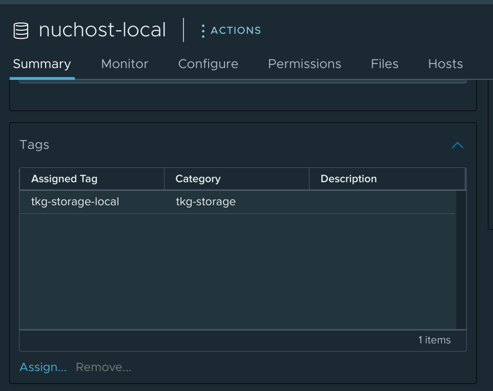

Then I create a new vSphere Storage Policy called `tkg-storage-policy` which states that data covered by the policy should be placed on the datastore(s) tagged with `tkg-storage-local`:
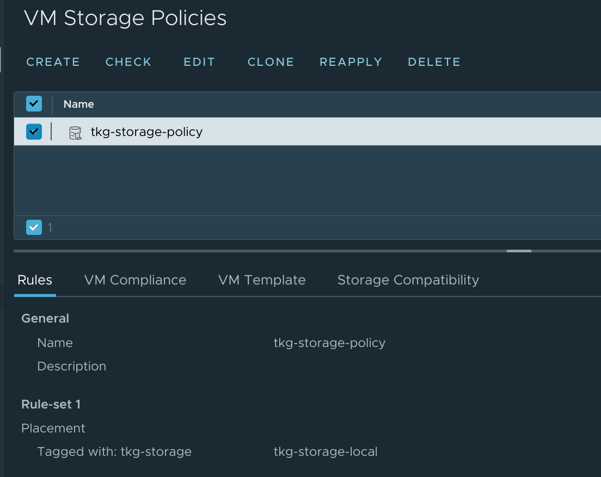

So that's the vSphere side of things sorted; now to map that back to the Kubernetes side. For that, I'll need to define a Storage Class tied to the vSphere Storage profile so I drop these details into a new file called `vsphere-sc.yaml`:
```yaml {linenos=true}
kind: StorageClass
apiVersion: storage.k8s.io/v1
metadata:
  name: vsphere
provisioner: csi.vsphere.vmware.com
parameters:
  storagePolicyName: tkg-storage-policy
```

And then apply it with :
```command-session
kubectl apply -f vsphere-sc.yaml
storageclass.storage.k8s.io/vsphere created
```

I can test that I can create a Persistent Volume Claim against the new `vsphere` Storage Class by putting this in a new file called `vsphere-pvc.yaml`:
```yaml {linenos=true}
apiVersion: v1
kind: PersistentVolumeClaim
metadata:
  labels:
    name: vsphere-demo-1
  name: vsphere-demo-1
spec:
  accessModes:
    - ReadWriteOnce
  storageClassName: vsphere
  resources:
    requests:
      storage: 5Gi
```

And applying it:
```command-session
kubectl apply -f demo-pvc.yaml
persistentvolumeclaim/vsphere-demo-1 created
```

I can see the new claim, and confirm that its status is `Bound`:
```command-session
kubectl get pvc
NAME             STATUS   VOLUME                                     CAPACITY   ACCESS MODES   STORAGECLASS   AGE
vsphere-demo-1   Bound    pvc-36cc7c01-a1b3-4c1c-ba0d-dff3fd47f93b   5Gi        RWO            vsphere        4m25s
```

And for bonus points, I can see that the container volume was created on the vSphere side:


So that's storage sorted. I'll clean up my test volume before moving on:
```command-session
kubectl delete -f demo-pvc.yaml
persistentvolumeclaim "vsphere-demo-1" deleted
```

### A real workload - phpIPAM
Demos are all well and good, but how about a real-world deployment to tie it all together? I've been using a [phpIPAM instance for assigning static IP addresses for my vRealize Automation deployments](/integrating-phpipam-with-vrealize-automation-8/), but have *only* been using it to monitor IP usage within the network ranges to which vRA will provision machines. I recently decided that I'd like to expand phpIPAM's scope so it can keep an eye on *all* the network ranges within the environment. That's not a big ask in [my little self-contained homelab](/vmware-home-lab-on-intel-nuc-9/), but having a single system scanning all the ranges of a large production network probably wouldn't scale too well.

Fortunately the phpIPAM project provides a [remote scanning agent](https://github.com/phpipam/phpipam-agent) which can be used for keeping an eye on networks and reporting back to the main phpIPAM server. With this, I could deploy an agent to each region (or multiple agents to a region!) and divide up the network into chunks that each agent would be responsible for scanning. But that's a pretty lightweight task for a single server to manage, and who wants to deal with configuring multiple instances of the same thing? Not this guy.

So I set to work exploring some containerization options, and I found [phpipam-docker](https://github.com/phpipam-docker/phpipam-docker). That would easily replicate my existing setup in a trio of containers (one for the web front-end, one for the database back-end, and one with `cron` jobs to run scans at regular intervals)... but doesn't provide a remote scan capability. I also found a [dockerized phpipam-agent](https://github.com/pierrecdn/phpipam-agent), but this one didn't quite meet my needs. It did provide me a base to work off of though so a few days of [tinkering](https://github.com/jbowdre/phpipam-agent-docker) resulted in me publishing my first [Docker image](https://github.com/jbowdre/phpipam-agent-docker/pkgs/container/phpipam-agent). I've still some work to do before this application stack is fully ready for production but it's at a point where I think it's worth doing a test deploy.

To start, I'll create a new namespace to keep things tidy:

```command-session
kubectl create ns ipam
namespace/ipam created
```

I'm going to wind up with four pods:
- `phpipam-db` for the database back-end
- `phpipam-www` for the web front-end
- `phpipam-cron` for the local cron jobs, which will be largely but not completely[^dns_scans] replaced by:
- `phpipam-agent` for my remote scan agent

I'll use each container's original `docker-compose` configuration and adapt that into something I can deploy on Kubernetes.

[^dns_scans]: My `phpipam-agent` image won't (yet?) do the DNS lookups that `phpipam-cron` can.

#### phpipam-db
The phpIPAM database will live inside a MariaDB container. Here's the relevant bit from `docker-compose`:
```yaml {linenos=true}
services:
  phpipam-db:
    image: mariadb:latest
    ports:
      - "3306:3306"
    environment:
      - MYSQL_ROOT_PASSWORD=VMware1!VMWare1!
    volumes:
      - phpipam-db-data:/var/lib/mysql
```

So it will need a `Service` exposing the container's port `3306` so that other pods can connect to the database. For my immediate demo, using `type: ClusterIP` will be sufficient since all the connections will be coming from within the cluster. When I do this for real, it will need to be `type: LoadBalancer` so that the agent running on a different cluster can connect. And it will need a `PersistentVolumeClaim` so it can store the database data at `/var/lib/mysql`. It will also get passed an environment variable to set the initial `root` password on the database instance (which will be used later during the phpIPAM install to create the initial `phpipam` database).

It might look like this on the Kubernetes side:
```yaml {linenos=true}
# phpipam-db.yaml
apiVersion: v1
kind: Service
metadata:
  name: phpipam-db
  labels:
    app: phpipam-db
  namespace: ipam
spec:
  type: ClusterIP
  ports:
  - name: mysql
    port: 3306
    protocol: TCP
    targetPort: 3306
  selector:
    app: phpipam-db
---
apiVersion: v1
kind: PersistentVolumeClaim
metadata:
  labels:
    name: phpipam-db
  name: phpipam-db-pvc
  namespace: ipam
spec:
  accessModes:
    - ReadWriteOnce
  storageClassName: vsphere
  resources:
    requests:
      storage: 5Gi
---
apiVersion: apps/v1
kind: Deployment
metadata:
  name: phpipam-db
  namespace: ipam
spec:
  selector:
    matchLabels:
      app: phpipam-db
  replicas: 1
  template:
    metadata:
      labels:
        app: phpipam-db
    spec:
      containers:
      - name: phpipam-db
        image: mariadb:latest
        env:
        - name: MYSQL_ROOT_PASSWORD
          value: "VMware1!VMware1!"
        ports:
        - name: mysql
          containerPort: 3306
        volumeMounts:
        - name: phpipam-db-vol
          mountPath: /var/lib/mysql
      volumes:
      - name: phpipam-db-vol
        persistentVolumeClaim:
          claimName: phpipam-db-pvc
```

Moving on:

#### phpipam-www
This is the `docker-compose` excerpt for the web component:
```yaml {linenos=true}
services:
  phpipam-web:
    image: phpipam/phpipam-www:1.5x
    ports:
      - "80:80"
    environment:
      - TZ=UTC
      - IPAM_DATABASE_HOST=phpipam-db
      - IPAM_DATABASE_PASS=VMware1!
      - IPAM_DATABASE_WEBHOST=%
    volumes:
      - phpipam-logo:/phpipam/css/images/logo
```

Based on that, I can see that my `phpipam-www` pod will need a container running the `phpipam/phpipam-www:1.5x` image, a `Service` of type `LoadBalancer` to expose the web interface on port `80`, a `PersistentVolumeClaim` mounted to `/phpipam/css/images/logo`, and some environment variables passed in to configure the thing. Note that the `IPAM_DATABASE_PASS` variable defines the password used for the `phpipam` user on the database (not the `root` user referenced earlier), and the `IPAM_DATABASE_WEBHOST=%` variable will define which hosts that `phpipam` database user will be able to connect from; setting it to `%` will make sure that my remote agent can connect to the database even if I don't know where the agent will be running.

Here's how I'd adapt that into a structure that Kubernetes will understand:
```yaml {linenos=true}
# phpipam-www.yaml
apiVersion: v1
kind: Service
metadata:
  name: phpipam-www
  labels:
    app: phpipam-www
  namespace: ipam
spec:
  type: LoadBalancer
  ports:
  - name: http
    port: 80
    protocol: TCP
    targetPort: 80
  selector:
    app: phpipam-www
---
apiVersion: v1
kind: PersistentVolumeClaim
metadata:
  labels:
    name: phpipam-www
  name: phpipam-www-pvc
  namespace: ipam
spec:
  accessModes:
    - ReadWriteOnce
  storageClassName: vsphere
  resources:
    requests:
      storage: 100Mi
---
apiVersion: apps/v1
kind: Deployment
metadata:
  name: phpipam-www
  namespace: ipam
spec:
  selector:
    matchLabels:
      app: phpipam-www
  replicas: 1
  template:
    metadata:
      labels:
        app: phpipam-www
    spec:
      containers:
      - name: phpipam-www
        image: phpipam/phpipam-www:1.5x
        env:
        - name: TZ
          value: "UTC"
        - name: IPAM_DATABASE_HOST
          value: "phpipam-db"
        - name: IPAM_DATABASE_PASS
          value: "VMware1!"
        - name: IPAM_DATABASE_WEBHOST
          value: "%"
        ports:
        - containerPort: 80
        volumeMounts:
        - name: phpipam-www-vol
          mountPath: /phpipam/css/images/logo
      volumes:
      - name: phpipam-www-vol
        persistentVolumeClaim:
          claimName: phpipam-www-pvc
```

#### phpipam-cron
This container has a pretty simple configuration in `docker-compose`:
```yaml {linenos=true}
services:
  phpipam-cron:
    image: phpipam/phpipam-cron:1.5x
    environment:
      - TZ=UTC
      - IPAM_DATABASE_HOST=phpipam-db
      - IPAM_DATABASE_PASS=VMware1!
      - SCAN_INTERVAL=1h
```

No exposed ports, no need for persistence - just a base image and a few variables to tell it how to connect to the database and how often to run the scans:

```yaml {linenos=true}
# phpipam-cron.yaml
apiVersion: apps/v1
kind: Deployment
metadata:
  name: phpipam-cron
  namespace: ipam
spec:
  selector:
    matchLabels:
      app: phpipam-cron
  replicas: 1
  template:
    metadata:
      labels:
        app: phpipam-cron
    spec:
      containers:
      - name: phpipam-cron
        image: phpipam/phpipam-cron:1.5x
        env:
        - name: IPAM_DATABASE_HOST
          value: "phpipam-db"
        - name: IPAM_DATABASE_PASS
          value: "VMWare1!"
        - name: SCAN_INTERVAL
          value: "1h"
        - name: TZ
          value: "UTC"
```

#### phpipam-agent
And finally, my remote scan agent. Here's the `docker-compose`:
```yaml {linenos=true}
services:
  phpipam-agent:
    container_name: phpipam-agent
    restart: unless-stopped
    image: ghcr.io/jbowdre/phpipam-agent:latest
    environment:
      - IPAM_DATABASE_HOST=phpipam-db
      - IPAM_DATABASE_NAME=phpipam
      - IPAM_DATABASE_USER=phpipam
      - IPAM_DATABASE_PASS=VMware1!
      - IPAM_DATABASE_PORT=3306
      - IPAM_AGENT_KEY=
      - IPAM_SCAN_INTERVAL=5m
      - IPAM_RESET_AUTODISCOVER=true
      - IPAM_REMOVE_DHCP=true
      - TZ=UTC
```

It's got a few additional variables to make it extra-configurable, but still no need for persistence or network exposure. That `IPAM_AGENT_KEY` variable will need to get populated the appropriate key generated within the new phpIPAM deployment, but we can deal with that later.

For now, here's how I'd tell Kubernetes about it:
```yaml {linenos=true}
# phpipam-agent.yaml
apiVersion: apps/v1
kind: Deployment
metadata:
  name: phpipam-agent
  namespace: ipam
spec:
  selector:
    matchLabels:
      app: phpipam-agent
  replicas: 1
  template:
    metadata:
      labels:
        app: phpipam-agent
    spec:
      containers:
      - name: phpipam-agent
        image: ghcr.io/jbowdre/phpipam-agent:latest
        env:
        - name: IPAM_DATABASE_HOST
          value: "phpipam-db"
        - name: IPAM_DATABASE_NAME
          value: "phpipam"
        - name: IPAM_DATABASE_USER
          value: "phpipam"
        - name: IPAM_DATABASE_PASS
          value: "VMware1!"
        - name: IPAM_DATABASE_PORT
          value: "3306"
        - name: IPAM_AGENT_KEY
          value: ""
        - name: IPAM_SCAN_INTERVAL
          value: "5m"
        - name: IPAM_RESET_AUTODISCOVER
          value: "true"
        - name: IPAM_REMOVE_DHCP
          value: "true"
        - name: TZ
          value: "UTC"
```

#### Deployment and configuration of phpIPAM
I can now go ahead and start deploying these containers, starting with the database one (upon which all the others rely):
```command-session
kubectl apply -f phpipam-db.yaml
service/phpipam-db created
persistentvolumeclaim/phpipam-db-pvc created
deployment.apps/phpipam-db created
```

And the web server:
```command-session
kubectl apply -f phpipam-www.yaml
service/phpipam-www created
persistentvolumeclaim/phpipam-www-pvc created
deployment.apps/phpipam-www created
```

And the cron runner:
```command-session
kubectl apply -f phpipam-cron.yaml
deployment.apps/phpipam-cron created
```

I'll hold off on the agent container for now since I'll need to adjust the configuration slightly after getting phpIPAM set up, but I will go ahead and check out my work so far:

```command-session
kubectl -n ipam get all
NAME                                READY   STATUS    RESTARTS   AGE
pod/phpipam-cron-6c994897c4-6rsnp   1/1     Running   0          4m30s
pod/phpipam-db-5f4c47d4b9-sb5bd     1/1     Running   0          16m
pod/phpipam-www-769c95c68d-94klg    1/1     Running   0          5m59s

NAME                  TYPE           CLUSTER-IP       EXTERNAL-IP    PORT(S)        AGE
service/phpipam-db    ClusterIP      100.66.194.69    <none>         3306/TCP       16m
service/phpipam-www   LoadBalancer   100.65.232.238   192.168.1.64   80:31400/TCP   5m59s

NAME                           READY   UP-TO-DATE   AVAILABLE   AGE
deployment.apps/phpipam-cron   1/1     1            1           4m30s
deployment.apps/phpipam-db     1/1     1            1           16m
deployment.apps/phpipam-www    1/1     1            1           5m59s

NAME                                      DESIRED   CURRENT   READY   AGE
replicaset.apps/phpipam-cron-6c994897c4   1         1         1       4m30s
replicaset.apps/phpipam-db-5f4c47d4b9     1         1         1       16m
replicaset.apps/phpipam-www-769c95c68d    1         1         1       5m59s
```

And I can point my browser to the `EXTERNAL-IP` associated with the `phpipam-www` service to see the initial setup page:


I'll click the **New phpipam installation** option to proceed to the next step:
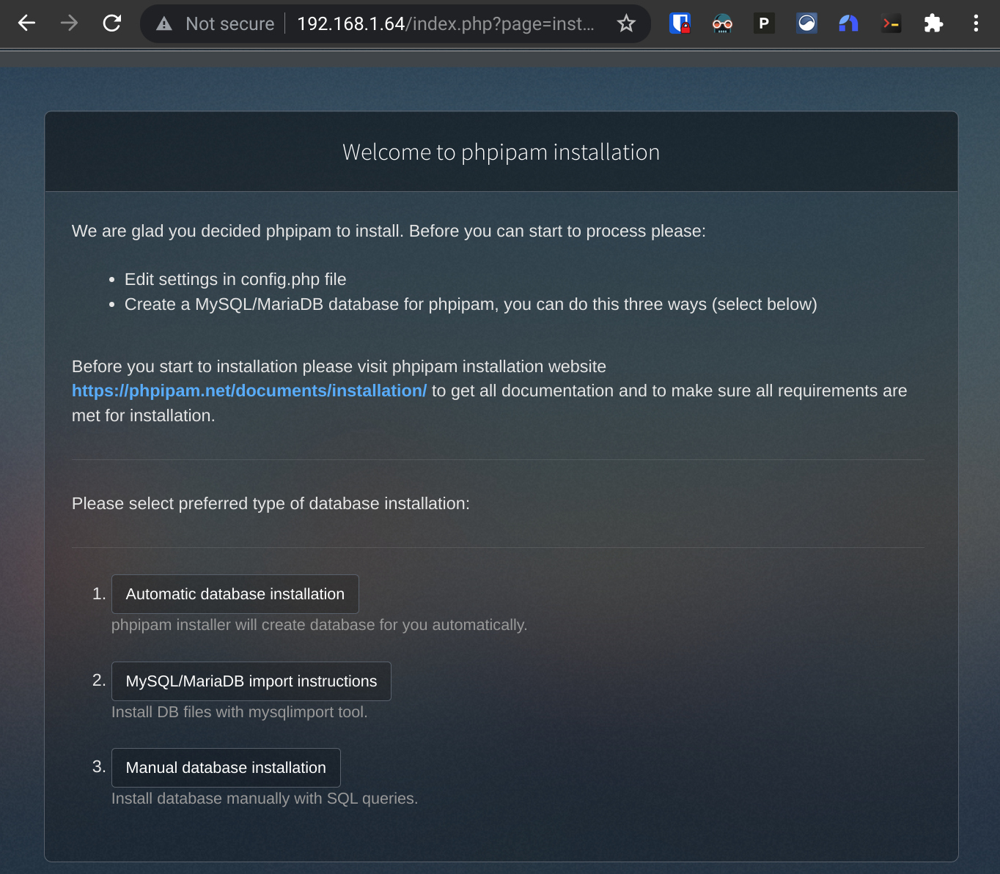

I'm all for easy so I'll opt for **Automatic database installation**, which will prompt me for the credentials of an account with rights to create a new database within the MariaDB instance. I'll enter `root` and the password I used for the `MYSQL_ROOT_PASSWORD` variable above:
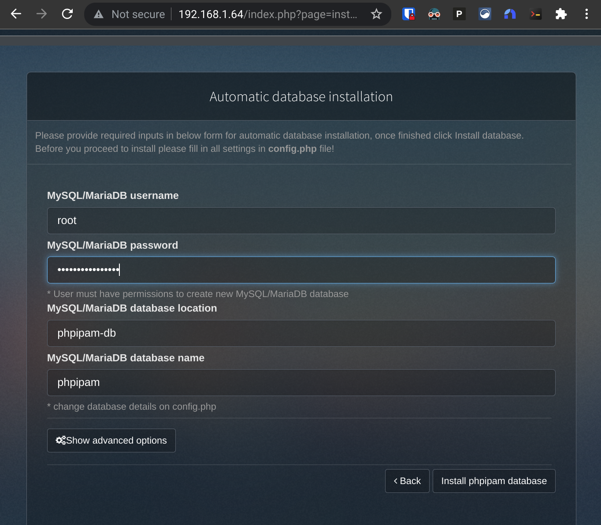

I click the **Install database** button and I'm then met with a happy success message saying that the `phpipam` database was successfully created.

And that eventually gets me to the post-install screen, where I set an admin password and proceed to log in:
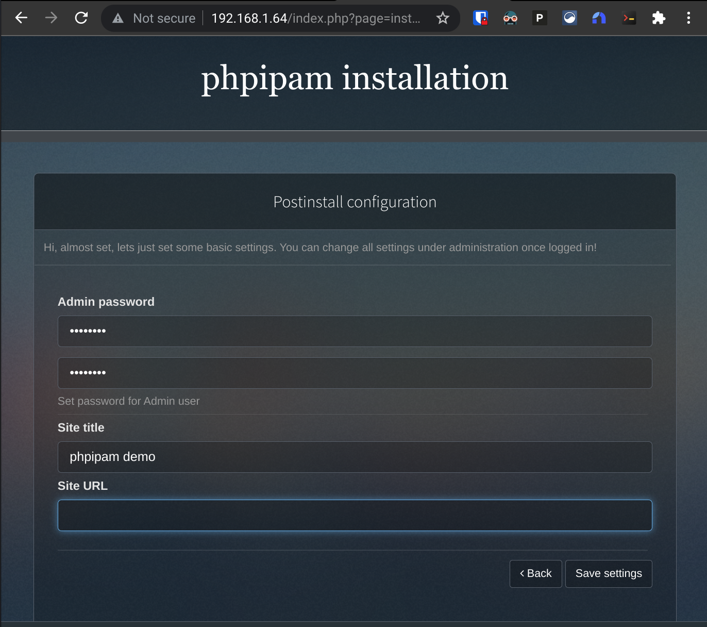

To create a new scan agent, I go to **Menu > Administration > Server management > Scan agents**.


And click the button to create a new one:


I'll copy the agent code and plug it into my `phpipam-agent.yaml` file:
```yaml
        - name: IPAM_AGENT_KEY
          value: "4DC5GLo-F_35cy7BEPnGn7HivtjP_o-v"
```

And then deploy that:
```command-session
kubectl apply -f phpipam-agent.yaml
deployment.apps/phpipam-agent created
```

The scan agent isn't going to do anything until it's assigned to a subnet though, so now I head to **Administration > IP related management > Sections**. phpIPAM comes with a few default sections and ranges and such defined so I'll delete those and create a new one that I'll call `Lab`.


Now I can create a new subnet within the `Lab` section by clicking the **Subnets** menu, selecting the `Lab` section, and clicking **+ Add subnet**.
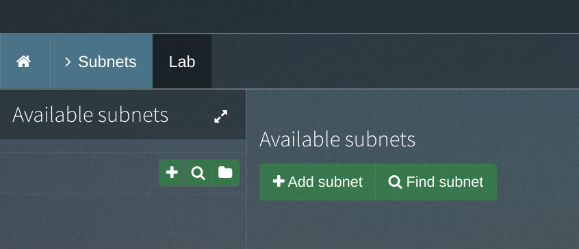

I'll define the new subnet as `192.168.1.0/24`. Once I enable the option to *Check hosts status*, I'll then be able to specify my new `remote-agent` as the scanner for this subnet.
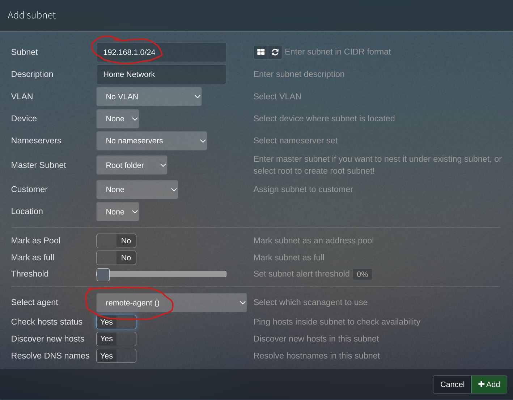
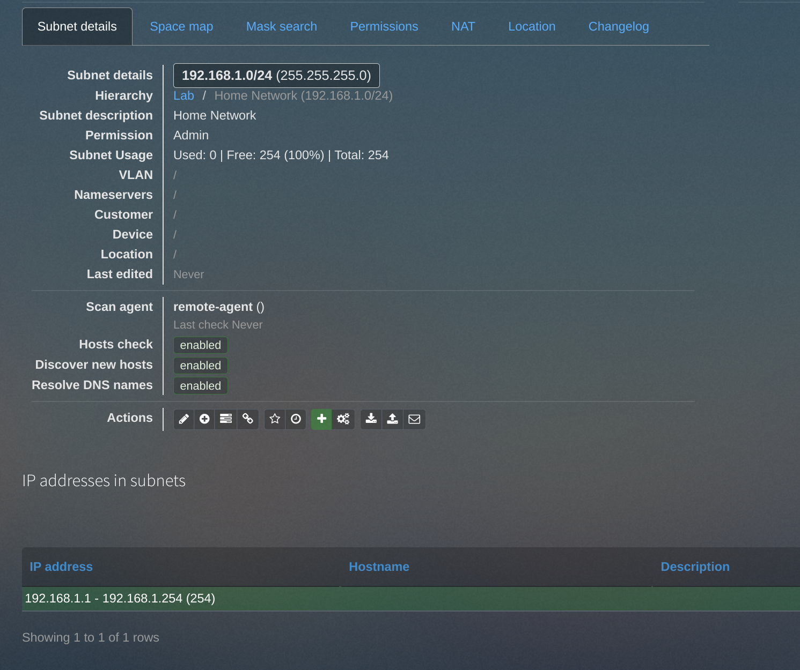

It shows the scanner associated with the subnet, but no data yet. I'll need to wait a few minutes for the first scan to kick off (at the five-minute interval I defined in the configuration).


Woah, it actually works!

### Conclusion
I still need to do more work to the containerized phpIPAM stack ready for production, but I'm feeling pretty good for having deployed a functional demo of it at this point! And working on this was a nice excuse to get a bit more familiar with Tanzu Community Edition specifically,  Kubernetes in general, and Docker (I learned a ton while assembling the `phpipam-agent` image!). I find I always learn more about a new-to-me technology when I have an actual project to do rather than just going through the motions of a lab exercise. Maybe my notes will be useful to you, too.